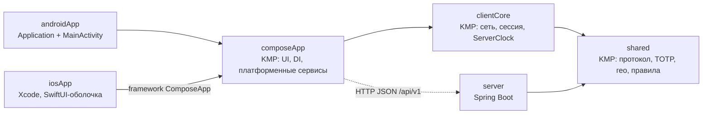
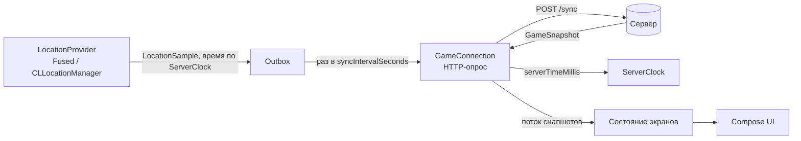
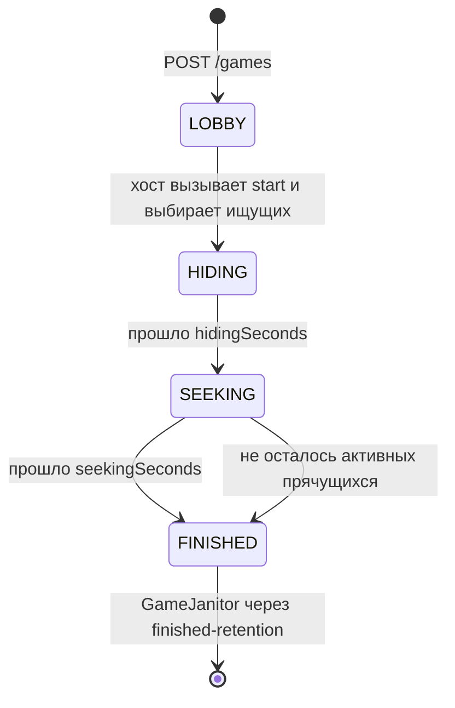
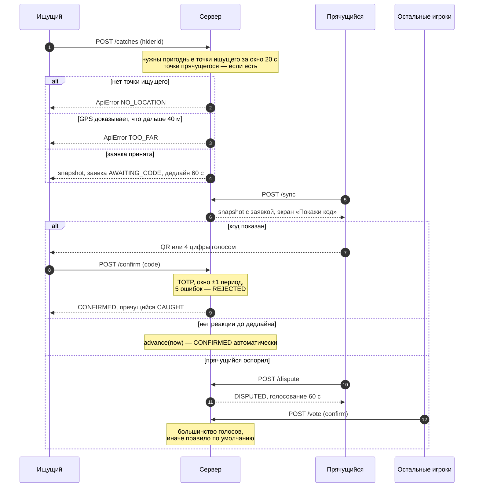

# Архитектура

Решение по стеку и его обоснование — в [ADR 0001](adr/0001-stack.md). Здесь — как устроен код.

## Модули

| Модуль | Таргеты | Что внутри |
|---|---|---|
| `:shared` | jvm, android, iosArm64, iosSimulatorArm64 | DTO протокола и `ApiRoutes`, `protocolJson`, TOTP-коды находки (свои SHA-1/HMAC на чистом Kotlin), гео-математика, расписание зоны, правила GPS: `LocationTrack`, `ZoneRules`, `CatchRules`. Без платформенных API. |
| `:server` | JVM 21 | Spring Boot, REST под `/api/v1`, `GameRegistry` в памяти, доменный объект `Game`, `GameJanitor`. |
| `:clientCore` | jvm, android, iosArm64, iosSimulatorArm64 | Клиентская логика без UI: `GameApi`/`HttpGameApi` (Ktor), `GameConnection`/`PollingGameConnection`, `LocationOutbox`, `ServerClock`, `GameSessionManager`, интерфейсы `LocationProvider` и `BackgroundTracker`. Без Compose и платформенного кода; JVM-таргет нужен headless-ботам e2e-тестов, чтобы они ходили через тот же сетевой код, что и приложение. |
| `:composeApp` | android, iosArm64, iosSimulatorArm64 | KMP-библиотека (`com.android.kotlin.multiplatform.library`): Compose UI, Koin, движки Ktor, реализации платформенных сервисов. На iOS собирается во framework `ComposeApp` (вместе с `:clientCore`). |
| `:androidApp` | Android | Тонкая точка входа: `Application` + `MainActivity`. AGP 9 со встроенным Kotlin. |
| `iosApp/` | iOS 16+ | Xcode-проект, SwiftUI-оболочка вокруг `MainViewControllerKt.mainViewController()`. Framework собирается Run Script-фазой `./gradlew :composeApp:embedAndSignAppleFrameworkForXcode`. Подробности — [iosApp/README.md](../iosApp/README.md). |

Главное правило: **всё, что должно одинаково работать на клиенте и сервере, живёт в `:shared`** (протокол, коды, зона, пороги GPS). Клиент использует это для подсказок и отрисовки, сервер — для решений.

## Слои клиента

| Слой | Ответственность | Где |
|---|---|---|
| UI | Экраны на Compose, `ZoneRadar` (Canvas-заглушка вместо карты), навигация по состоянию: какой экран показывать, решает состояние сессии, а не стек переходов | `:composeApp`, `commonMain` |
| Состояние экранов | ViewModel'и / стейт-холдеры: превращают `GameSnapshot` и локальные данные в UI-state, принимают действия пользователя | `:composeApp`, `commonMain` |
| Игровая сессия | `GameSessionManager`: цикл синхронизации, outbox координат, `ServerClock` | `:clientCore`, `commonMain` |
| Сеть | `GameApi` (Ktor, `protocolJson`), `GameConnection` — транспорт за интерфейсом (сейчас HTTP-опрос) | `:clientCore`, `commonMain`; движок Ktor выбирает `:composeApp`: OkHttp (Android), Darwin (iOS) |
| Платформенные сервисы | `LocationProvider`, `BackgroundTracker`, `ProximityScanner`, `CatchCodeScanner` | интерфейсы в `commonMain` (`LocationProvider` и `BackgroundTracker` — в `:clientCore`), реализации в `:composeApp` `androidMain` / `iosMain` |
| DI | Koin-модули: общий + платформенный | `:composeApp`, `commonMain` + `androidMain` / `iosMain` |

Платформенные реализации:

| Сервис | Android | iOS | Статус |
|---|---|---|---|
| `LocationProvider` | FusedLocationProvider (play-services-location) | `CLLocationManager` | работает |
| `BackgroundTracker` | foreground service с типом `location` | фоновый режим `location` | работает |
| `ProximityScanner` | — | — | no-op, BLE через Kable после MVP |
| `CatchCodeScanner` | CameraX + ML Kit (план) | AVFoundation (план) | expect/actual-заглушка, ручной ввод кода работает |

## Раунд: поток данных

Клиент раз в `GameRules.syncIntervalSeconds` (по умолчанию 3 с) отправляет накопленные координаты и получает в ответ свежее состояние игры. Любой изменяющий запрос (заявка, код, голос) тоже сразу возвращает `GameSnapshot`, чтобы UI не ждал следующего опроса.

- **Outbox.** Точки копятся в очереди и уходят пачкой (`SyncRequest.samples`, не больше 100 за запрос). Если запрос не прошёл (нет сети), точки остаются в очереди и уйдут со следующим — сервер сортирует их по времени и отбрасывает дубли и невозможные скачки (`LocationTrack`).
- **Фон.** `BackgroundTracker` держит геолокацию и цикл синхронизации живыми при заблокированном экране. HTTP-опрос выбран в том числе потому, что он надёжнее WebSocket в фоне на iOS.
- **Замена транспорта.** Остальной код знает только `GameConnection`. Для WebSocket/SSE достаточно новой реализации интерфейса и смены биндинга в Koin.

## Сервер: время и состояние

- `Game` — чистый доменный объект: без Spring, без потоков, время передаётся параметром. Все правила тестируются юнит-тестами без моков времени.
- Переходы по времени (конец фазы, дедлайны заявок, выход из зоны) применяются лениво: `GameService` вызывает `game.advance(now)` до и после каждого действия. Фонового тикера нет: игра «догоняет» время при каждом запросе.
- Доступ к одной игре сериализован (`synchronized(game)`), разные игры не мешают друг другу.
- `GameRegistry` хранит игры, join-коды и токены в памяти (`ConcurrentHashMap`). Для горизонтального масштабирования его заменяют на Redis/Postgres за теми же методами (см. [roadmap](roadmap.md)). Пока сервер — **один экземпляр**, рестарт теряет идущие игры.
- Аутентификация: при создании игры или входе сервер выдаёт `PlayerSession` с токеном; все остальные запросы — с `Authorization: Bearer <token>`. Токен привязан к одной игре и одному игроку.

## Модель времени

Все метки времени в протоколе — **время сервера** (epoch millis).

- Каждый `GameSnapshot` несёт `serverTimeMillis`. Клиентский `ServerClock` вычисляет по нему смещение относительно часов телефона и отдаёт «текущее время сервера».
- `LocationSample.timestampMillis` клиент проставляет по `ServerClock`. Сервер не доверяет меткам из будущего и обрезает их до `now`.
- Таймеры фаз (`phaseEndsAtMillis`), дедлайны заявок (`CatchView.deadlineMillis`), таймер возврата в зону (`MyState.outOfZoneDeadlineMillis`) — тоже время сервера; клиент считает обратный отсчёт через `ServerClock`.
- Зона не передаётся каждый раз: клиент получает `ZoneSchedule` в настройках и `zoneStartedAtMillis`, а текущий круг считает сам через `ZoneSchedule.stateAt(serverNow - zoneStartedAtMillis)` — ту же функцию, что использует сервер.
- TOTP-код прячущийся генерирует по `ServerClock`, поэтому неверные часы телефона не ломают подтверждение. Сервер принимает код текущего, предыдущего и следующего периода (±30 с).

## Фазы игры

- **LOBBY** — игроки входят по join-коду (6 символов, до 30 игроков). Роли назначает хост при старте.
- **HIDING** — прячущиеся расходятся, ищущие ждут. Прячущиеся получают `MyState.catchCodeSecret`. Ищущие видят друг друга.
- **SEEKING** — стартует расписание зоны, работают заявки на находку, проверка зоны и раскрытия.
- **FINISHED** — все пойманы/выбыли или вышло время. Открытые заявки закрываются как `REJECTED`.

Игру без активности дольше `idle-retention` (6 ч) `GameJanitor` удаляет в любой фазе.

## Видимость: сервер решает, что можно видеть

Сервер никогда не отправляет позицию, которую зритель не должен видеть: `Game.snapshotFor(viewer)` фильтрует состояние под конкретного игрока. Модифицированный клиент не может «подсмотреть» координаты — их просто нет в ответе. Поле `PlayerView.location` присутствует только вместе с причиной (`VisibilityReason`).

| Кто смотрит | Кого видит | Когда | `VisibilityReason` |
|---|---|---|---|
| Прячущийся | никого | — | — |
| Ищущий | других ищущих | HIDING и SEEKING | `TEAMMATE` |
| Ищущий | активного прячущегося | SEEKING, уверенно за зоной | `OUT_OF_ZONE` |
| Ищущий | активного прячущегося | SEEKING, была подменённая точка за последние 60 с | `MOCK_LOCATION` |
| Ищущий | активного прячущегося | SEEKING, нет новых точек GPS дольше `staleLocationRevealSeconds` (45 с), даже если приложение продолжает слать sync | `STALE_SIGNAL` |

Показывается последняя принятая точка игрока с её accuracy и временем. В LOBBY и FINISHED позиции не отдаются никому.

## Честная игра: GPS — подсказка, а не судья

Реализация правил из ADR ([«Точность GPS»](adr/0001-stack.md#точность-gps), [«Честная игра»](adr/0001-stack.md#честная-игра)). Пороги — в `GameRules`, их можно менять при создании игры.

- **Фильтр точек** (`LocationTrack`): подменённые точки (`isMock`) не попадают в трек, но запоминается время последней подмены; точки не по порядку и скачки быстрее `maxPlausibleSpeedMetersPerSecond` (12 м/с с учётом accuracy) отбрасываются.
- **Пригодные точки**: accuracy не хуже `maxUsableAccuracyMeters` (20 м). Только они участвуют в решениях.
- **Зона** (`ZoneRules`): игрок «уверенно за зоной», только если в окне `decisionWindowSeconds` (20 с) есть минимум `minFixesForDecision` (3) пригодных точек и все они за границей с запасом `accuracy + zoneBorderMarginMeters` (10 м). Тогда он раскрывается (`OUT_OF_ZONE`) и получает `outOfZoneDeadlineMillis`; не вернулся за `outOfZoneGraceSeconds` (60 с) — `ELIMINATED`. Возврат тоже решается не по одной точке: предупреждение снимается, когда последние `minFixesForDecision` пригодных точек не за границей (`ZoneRules.isConfidentlyBack`); одна точка, «прыгнувшая» внутрь, таймер не сбрасывает.
- **Дистанция находки** (`CatchRules`): минимально возможное расстояние = расстояние между точками минус оба радиуса accuracy, берётся лучшая пара из всех пригодных точек обоих игроков за окно решений (не одна точка). Заявка отклоняется, только если GPS *доказывает*, что игроки дальше `catchMaxDistanceMeters` (40 м). Для правила по умолчанию в споре запоминается и наиболее вероятное расстояние (ближайшая пара точек без учёта accuracy).

## Находка

Статусы заявки: `AWAITING_CODE` → `CONFIRMED` / `REJECTED` / `DISPUTED` → `CONFIRMED` / `REJECTED`.

Детали:

- Заявка возможна только в SEEKING, от активного ищущего на активного прячущегося, и если ни у одного из них нет другой открытой заявки.
- Если у прячущегося нет свежих пригодных точек, GPS не может опровергнуть заявку — решает код.
- Пока заявка или спор открыты, участники «заморожены»: у них не может быть других заявок, а прячущегося не выбивают за выход из зоны.
- QR содержит `hovanki:1:<gameId>:<playerId>:<code>` (`CatchCodePayload`); те же 4 цифры можно продиктовать и ввести вручную. Код меняется каждые 30 с.
- Голосуют все игроки, кроме двух участников спора. Если голосовать некому, спор решается сразу. Спор закрывается, когда проголосовали все, или по дедлайну.
- Правило по умолчанию (нет голосов или ничья): засчитать, если наиболее вероятное расстояние в момент заявки не больше `catchMaxDistanceMeters` (40 м) или неизвестно (прячущийся не присылал точки). Заявку можно открыть при «возможно, рядом» (с учётом accuracy), а правило по умолчанию требует «вероятно, рядом».
- Когда активных прячущихся не остаётся, игра переходит в FINISHED.

## Данные и GDPR

Геоданные — персональные данные. Принципы из ADR: явное согласие, хранение только на время игры, удаление после.

- Сервер хранит всё **только в памяти**, базы данных нет.
- `LocationTrack` держит точки игрока за последние 5 минут, старые удаляются по мере поступления новых.
- `GameJanitor` раз в `cleanup-interval` (1 мин) удаляет игры вместе с треками, игроками и токенами: завершённые — через `finished-retention` (30 мин, запас на разбор после игры), брошенные — после `idle-retention` (6 ч) без запросов. Настройки — `hovanki.games.*` в `server/src/main/resources/application.yaml`.
- Координаты и токены не пишем в логи.
- Секрет кода находки получает только сам прячущийся (`MyState.catchCodeSecret`).
- Системный запрос геолокации сопровождается объяснением (на iOS — `NSLocationWhenInUseUsageDescription`: координаты уходят на сервер только на время раунда). Отдельный экран согласия — в [roadmap](roadmap.md).

## API

Пути — константы в `shared/src/commonMain/kotlin/app/hovanki/shared/protocol/ApiRoutes.kt`, DTO — в том же пакете, контроллер — `server/src/main/kotlin/app/hovanki/server/api/GameController.kt` (тонкий адаптер к `GameService`). Формат — JSON с настройками `protocolJson`. Все запросы, кроме создания и входа, требуют `Authorization: Bearer <token>`.

| Метод | Путь | Кто вызывает | Тело запроса | Ответ |
|---|---|---|---|---|
| POST | `/api/v1/games` | любой, становится хостом | `CreateGameRequest` | `SessionResponse` |
| POST | `/api/v1/games/join` | любой, по join-коду | `JoinGameRequest` | `SessionResponse` |
| POST | `/api/v1/games/{gameId}/start` | хост, в LOBBY | `StartGameRequest` | `GameSnapshot` |
| POST | `/api/v1/games/{gameId}/sync` | любой игрок, каждые ~3 с | `SyncRequest` | `GameSnapshot` |
| POST | `/api/v1/games/{gameId}/catches` | активный ищущий, в SEEKING | `ClaimCatchRequest` | `GameSnapshot` |
| POST | `/api/v1/games/{gameId}/catches/{catchId}/confirm` | ищущий из заявки | `ConfirmCatchRequest` | `GameSnapshot` |
| POST | `/api/v1/games/{gameId}/catches/{catchId}/dispute` | прячущийся из заявки | — | `GameSnapshot` |
| POST | `/api/v1/games/{gameId}/catches/{catchId}/vote` | игрок вне спора | `VoteRequest` | `GameSnapshot` |
| GET | `/actuator/health` (+ `/liveness`, `/readiness`) | мониторинг | — | статус Spring Boot |

Любая ошибка приходит телом `ApiError(code, message)` (`ApiExceptionHandler`); клиент ориентируется на `code`, HTTP-статус — для прокси и логов:

| `ErrorCode` | HTTP | Когда |
|---|---|---|
| `BAD_REQUEST` | 400 | Некорректное тело или настройки, неверное имя, больше 100 точек в `sync` |
| `UNAUTHORIZED` | 401 | Нет токена, или игра уже удалена вместе с токенами |
| `FORBIDDEN` | 403 | Действие не для этой роли / игрока, токен от другой игры |
| `NOT_FOUND` | 404 | Нет игры, игрока или заявки |
| `WRONG_STATE` | 409 | Не та фаза, заявка закрыта, игра заполнена |
| `NO_LOCATION`, `TOO_FAR`, `INVALID_CODE` | 422 | Правила находки: нет точной точки, GPS доказывает, что далеко, неверный код |
| `INTERNAL` | 500 | Непредвиденная ошибка (подробности только в логе сервера) |

### Совместимость протокола

Старые версии приложения живут у игроков долго, поэтому протокол меняется только обратно совместимо:

- новые поля — только со значением по умолчанию; поля не переименовываем и не удаляем, пути не меняем;
- `protocolJson` игнорирует неизвестные поля (`ignoreUnknownKeys`), а неизвестное значение enum заменяет значением по умолчанию свойства (`coerceInputValues`). **У свойства без значения по умолчанию** (например, `VisibleLocation.reason`, `GameSnapshot.phase`) новое значение enum сломает разбор у старых клиентов — такие изменения делаем через новое поле с дефолтом или новую версию API;
- несовместимое изменение — новый префикс (`/api/v2`), старый живёт, пока им пользуются.

## Как добавить…

### Новый эндпоинт

1. `:shared` — путь в `ApiRoutes` (шаблон + функция-построитель), DTO запроса в `Messages.kt` (`@Serializable`, новые поля с дефолтами). Тест сериализации в `commonTest`, если формат нетривиальный.
2. `:server` — метод доменного объекта `Game` (время параметром, ошибки через `GameException(ErrorCode, ...)`) и юнит-тест на него; метод `GameService` через `update(caller, gameId) { game, now -> ... }`, чтобы получить блокировку, `advance(now)` и снапшот; маппинг в контроллере.
3. `:clientCore` — метод в `GameApi`/`HttpGameApi` и команда в `GameSessionManager` (ответ-снапшот — в ту же точку, куда приходят снапшоты синхронизации); `:composeApp` — вызов из состояния экрана.
4. Обновить таблицу API выше.

### Новый платформенный сервис

1. Интерфейс в `composeApp/src/commonMain` (без платформенных типов в сигнатурах; потоки — `Flow`). Если сервис нужен `GameSessionManager`, интерфейс — в `clientCore/src/commonMain`.
2. Реализации в `androidMain` и `iosMain`; no-op или фейк — для тестов и для платформы, где сервис ещё не готов.
3. Биндинг в платформенном Koin-модуле; общий код получает интерфейс через `get()` / `koinInject()`.
4. Разрешения и описания: `AndroidManifest.xml` в `androidApp`/`composeApp`, `Info.plist` в `iosApp` (`NS…UsageDescription`, `UIBackgroundModes`).
5. API, доступное только из Swift, — через небольшую Swift-обёртку в `iosApp`, реализующую Kotlin-интерфейс.
6. `expect`/`actual` — только для мелкой склейки (например, фабрика движка или платформенная константа), не для сервисов.

### Новый экран

1. Добавить состояние экрана в модель навигации: навигация ведётся по состоянию, экран — это функция от состояния сессии.
2. Composable в `commonMain`, без платформенного кода; состояние — в ViewModel/стейт-холдере, зарегистрированном в Koin.
3. Время на экране — только через `ServerClock`, данные игры — только из `GameSnapshot`.
4. Проверить на обеих платформах (Android-эмулятор и iOS-симулятор).
