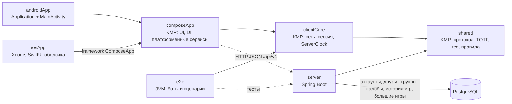
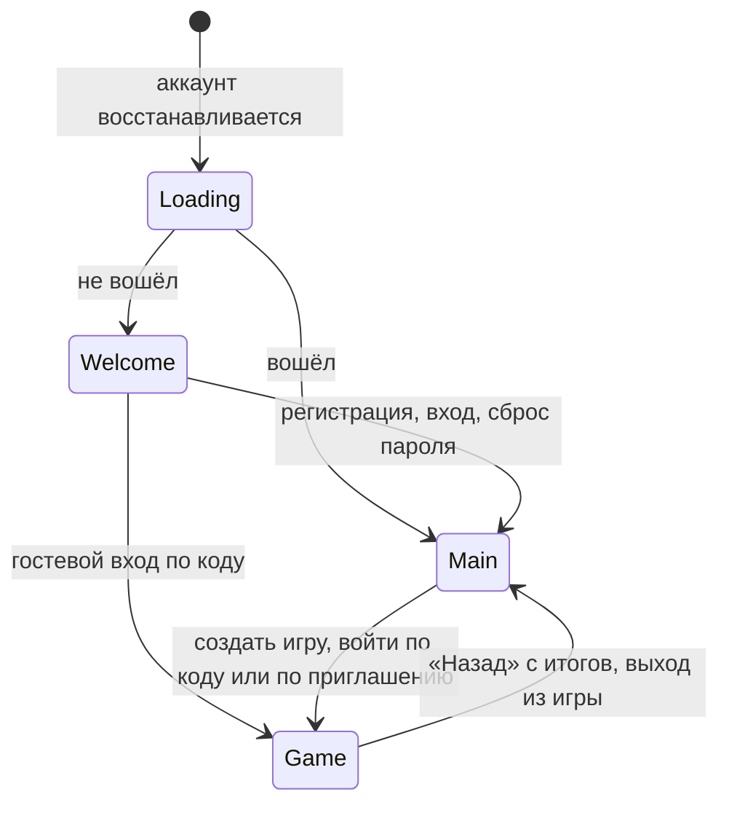
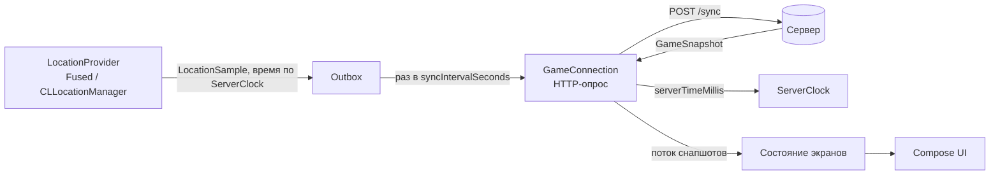
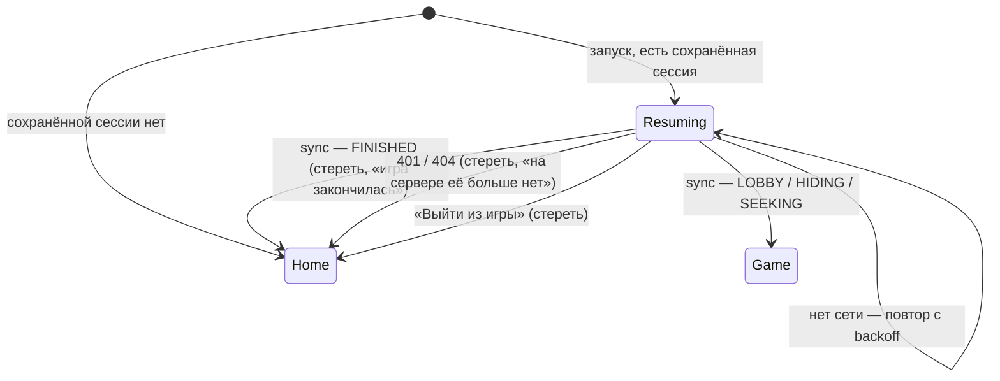
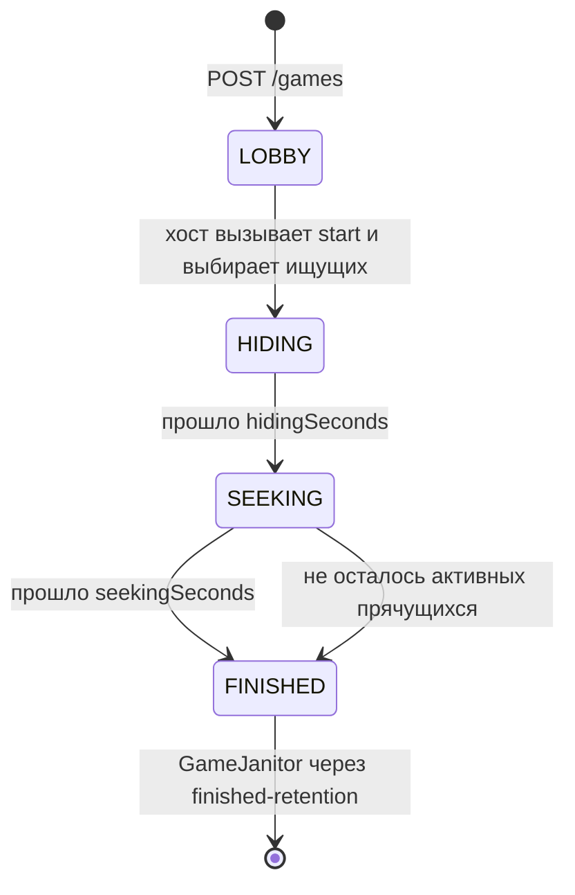
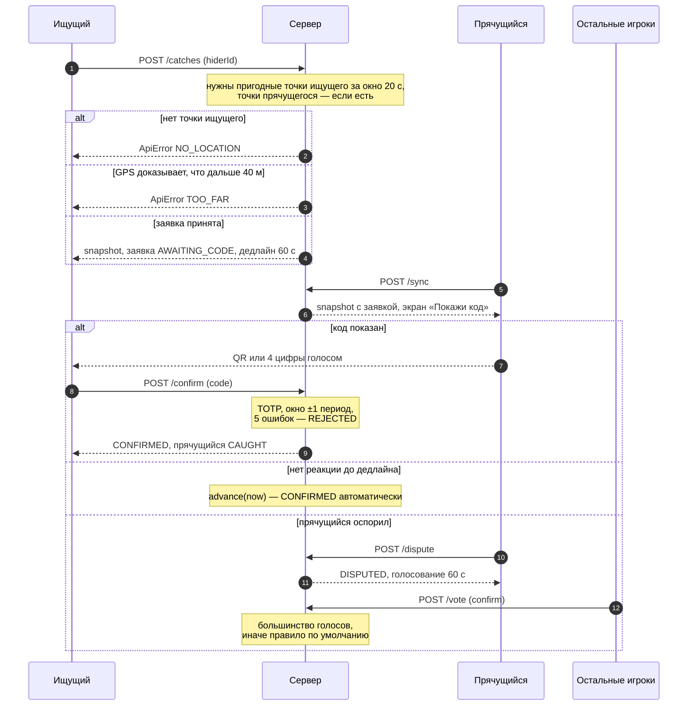

# Архитектура

Решение по стеку и его обоснование — в [ADR 0001](adr/0001-stack.md), хранение сессии на устройстве — в [ADR 0002](adr/0002-session-storage.md), карта и здания как запретная зона — в [ADR 0003](adr/0003-map-and-buildings.md), аккаунты, друзья, группы и чат — в [ADR 0004](adr/0004-accounts-friends-chat.md), история игр, маршруты и статистика — в [ADR 0007](adr/0007-game-history-and-routes.md), вместимость зоны и большие игры — в [ADR 0010](adr/0010-big-games.md), что можно считать для аналитики — в [metrics.md](metrics.md). Здесь — как устроен код.

## Модули

```mermaid
flowchart LR
    androidApp["androidApp<br/>Application + MainActivity"] --> composeApp
    iosApp["iosApp<br/>Xcode, SwiftUI-оболочка"] -->|"framework ComposeApp"| composeApp
    composeApp["composeApp<br/>KMP: UI, DI, платформенные сервисы"] --> clientCore
    clientCore["clientCore<br/>KMP: сеть, сессия, ServerClock"] --> shared
    server["server<br/>Spring Boot"] --> shared
    server -->|"аккаунты, друзья, группы, жалобы, история игр, большие игры"| db[("PostgreSQL")]
    e2e["e2e<br/>JVM: боты и сценарии"] --> clientCore
    e2e -.->|"тесты"| server
    shared["shared<br/>KMP: протокол, TOTP, гео, правила"]
    composeApp -.->|"HTTP JSON /api/v1"| server
```

| Модуль | Таргеты | Что внутри |
|---|---|---|
| `:shared` | jvm, android, iosArm64, iosSimulatorArm64 | DTO протокола и `ApiRoutes`, `protocolJson`, TOTP-коды находки и сотрудников (свои SHA-1/HMAC на чистом Kotlin), кодировщик QR, гео-математика, расписание зоны, правила GPS: `LocationTrack`, `ZoneRules`, `CatchRules`; зона по улицам (`ZoneArea`), сужение до конца поиска (`withEndgame`), свечение (`Glow`), настройки хоста и их границы (`GameSetup`, `SettingsLimits`); вместимость зоны (`Capacity`, `AreaNorms`), большие игры (`BigGameSetup`, `BigGameLimits`); маршрут для истории: `RouteRecorder` (прореживание точек, расстояние без дрожания GPS). Без платформенных API. |
| `:server` | JVM 21 | Spring Boot, REST под `/api/v1`. Игры — в памяти: `GameRegistry`, доменный объект `Game` (с чатом), `GameJanitor`. Аккаунты, друзья, блокировки, группы, жалобы, история законченных игр, расписание больших игр и записи на них — в PostgreSQL (`JdbcClient`, миграции Flyway). Пакеты: `game/`, `account/`, `mail/`, `social/` (друзья, группы, приглашения в памяти), `history/` (итоги игр, маршруты, статистика), `moderation/` (жалобы, баны и запреты чата), `admin/` (вход сотрудников с TOTP, админ-сессии, журнал, [ADR 0008](adr/0008-admin.md)), `ratelimit/`, `db/`, `api/`, `buildings/` (здания зоны), `map/` (векторные тайлы, декодер MVT, зона по улицам, местность для вместимости: `TerrainReader`, `TerrainLoader`), `bigGames/` (большие игры: расписание, записи, планировщик, нарисованная зона, `RestartHoldEndpoint`, [ADR 0010](adr/0010-big-games.md)). Страница админки — статика `src/main/resources/static/admin/` на `/admin`. |
| `:clientCore` | jvm, android, iosArm64, iosSimulatorArm64 | Клиентская логика без UI: `GameApi`/`HttpGameApi`, `AccountApi`, `SocialApi`, `BigGameApi` (Ktor), `GameConnection`/`PollingGameConnection`, `LocationOutbox`, `ServerClock`, `GameSessionManager` (с чатом), `AccountManager`, `SocialManager`, `HistoryManager`, `BigGameManager`, `ClientStorage`, интерфейсы `LocationProvider`, `BackgroundTracker` и `SecureStore`. Без Compose и платформенного кода; JVM-таргет нужен headless-ботам e2e-тестов, чтобы они ходили через тот же сетевой код, что и приложение. |
| `:composeApp` | android, iosArm64, iosSimulatorArm64 | KMP-библиотека (`com.android.kotlin.multiplatform.library`): Compose UI, Koin, движки Ktor, реализации платформенных сервисов. На iOS собирается во framework `ComposeApp` (вместе с `:clientCore`). |
| `:androidApp` | Android | Тонкая точка входа: `Application` + `MainActivity`. AGP 9 со встроенным Kotlin. |
| `:e2e` | JVM 21 | End-to-end тесты: headless-боты на коде `:clientCore` с имитацией GPS, часов и сети играют целые партии против настоящего сервера (в тестах он поднимается в том же процессе). Там же оркестратор слоя устройств: debug-приложение на эмуляторах и симуляторах, UI через Maestro. См. [e2e.md](e2e.md). |
| `iosApp/` | iOS 16+ | Xcode-проект, SwiftUI-оболочка вокруг `MainViewControllerKt.mainViewController()`. Framework собирается Run Script-фазой `./gradlew :composeApp:embedAndSignAppleFrameworkForXcode`. Подробности — [iosApp/README.md](../iosApp/README.md). |

Главное правило: **всё, что должно одинаково работать на клиенте и сервере, живёт в `:shared`** (протокол, коды, зона, пороги GPS). Клиент использует это для подсказок и отрисовки, сервер — для решений.

## Слои клиента

| Слой | Ответственность | Где |
|---|---|---|
| UI | Экраны на Compose, карта `GameMap` (maplibre-compose, тайлы OpenFreeMap, [ADR 0003](adr/0003-map-and-buildings.md)), навигация по состоянию: какой экран показывать, решает состояние сессии, а не стек переходов | `:composeApp`, `commonMain` |
| Состояние экранов | ViewModel'и / стейт-холдеры: превращают `GameSnapshot`, аккаунт, друзей и локальные данные в UI-state, принимают действия пользователя | `:composeApp`, `commonMain` |
| Игровая сессия | `GameSessionManager`: цикл синхронизации, outbox координат, `ServerClock`, чат (слияние по `seq`, курсор в каждом опросе, непрочитанные), сохранение сессии и возврат в игру после перезапуска, загрузка зданий зоны и зоны по улицам (один раз на `mapRevision`, когда снапшот говорит `READY`), команды лобби (роли, настройки, выход) и треков для разбора (один раз, когда игра `FINISHED`); итоги и награды считает `session/Results.kt` из последнего снапшота и треков | `:clientCore`, `commonMain` |
| Аккаунт и друзья | `AccountManager`: кто вошёл, команды аккаунта, восстановление после перезапуска, 401 → выход. `SocialManager`: друзья, группы, входящие (опрос раз в 10 с, пока их кто-то слушает). `HistoryManager`: своя статистика, история игр и маршруты, согласие «Сохранять мои маршруты» (загрузка по требованию экрана). `BigGameManager`: список больших игр (опрос раз в 30 с, пока открыта вкладка «Играть»), запись и отмена | `:clientCore`, `commonMain` |
| Хранилище | `ClientStorage` поверх `SecureStore`: сохранённая сессия игры, аккаунт (токен и профиль), имя гостя, последние настройки хоста | `:clientCore`, `commonMain`; реализации `SecureStore` — `:composeApp` `androidMain` / `iosMain` |
| Сеть | `GameApi`, `AccountApi`, `SocialApi`, `HistoryApi`, `BigGameApi` (Ktor, `protocolJson`, общие хелперы `HttpSupport`), `GameConnection` — транспорт за интерфейсом (сейчас HTTP-опрос) | `:clientCore`, `commonMain`; движок Ktor выбирает `:composeApp`: OkHttp (Android), Darwin (iOS) |
| Платформенные сервисы | `LocationProvider`, `BackgroundTracker`, `SecureStore`, `ProximityScanner`, `CatchCodeScanner`, `ShareSheet` | интерфейсы в `commonMain` (`LocationProvider`, `BackgroundTracker` и `SecureStore` — в `:clientCore`), реализации в `:composeApp` `androidMain` / `iosMain` |
| DI | Koin-модули: общий + платформенный | `:composeApp`, `commonMain` + `androidMain` / `iosMain` |

Платформенные реализации:

| Сервис | Android | iOS | Статус |
|---|---|---|---|
| `LocationProvider` | FusedLocationProvider (play-services-location) | `CLLocationManager` | работает |
| `BackgroundTracker` | foreground service с типом `location`; тревоги прячущегося — уведомления без звука с вибрацией | фоновый режим `location`; тревоги — вибрация и уведомление без звука | работает; когда вибрировать, решает `AlertRepeats` в `:clientCore` |
| `SecureStore` | AES-GCM, ключ в Android Keystore, шифротекст в приватных `SharedPreferences` | Keychain, `AfterFirstUnlockThisDeviceOnly` | работает, [ADR 0002](adr/0002-session-storage.md) |
| `ProximityScanner` | — | — | no-op, BLE через Kable после MVP |
| `CatchCodeScanner` | CameraX + ZXing | AVFoundation (`AVCaptureMetadataOutput`) | работает; ручной ввод кода — всегда |
| `ShareSheet` | chooser для `ACTION_SEND` | `UIActivityViewController` (на iPad — поповер из центра экрана) | работает: «Поделиться» кодом в лобби |

### Автоматизация UI (только debug)

Для e2e-тестов на эмуляторах и симуляторах ([e2e.md](e2e.md)); release-сборки это поведение не меняет.

- Ключевые элементы помечены `Modifier.testTag`, константы — `TestTags` в `:clientCore` (пакет `app.hovanki.client.automation`, общий с оркестратором e2e). На Android debug-сборка включает `testTagsAsResourceId` (`AutomationRoot`), и теги становятся resource-id. На iOS Compose отдаёт их как `accessibilityIdentifier`.
- `LaunchOptions` (там же) — адрес сервера, имя, пароль, join-код, время пряток для игры, созданной с устройства. `onAppStart` применяет их один раз на процесс, в таком порядке: адрес сервера → `forgetSavedGame` (стереть сохранённую игру) и `logOut` (выйти из аккаунта) → восстановление аккаунта → вход, если заданы `name` и `password` (`name` — ник или email) → возврат в сохранённую игру. Имя и join-код предзаполняют поля вместо ввода руками: имя — у гостевого входа, код — у входа по коду.
  - Android читает их только в source set `debug` (`androidApp/src/debug`): extras `hovanki.*` или deep link `hovanki://join?server=…&name=…&joinCode=…`, объявленный только в debug-манифесте. В `release` лежат no-op-двойники, их же берёт тестовая сборка `preview`.
  - iOS читает `NSUserDefaults` (launch arguments `-hovanki.server …`) только в debug-бинаре (`Platform.isDebugBinary`).

### Сборки и адрес сервера

Сервер один, поля «Адрес сервера» в приложении нет: аккаунты, друзья и группы живут на одном сервере ([ADR 0004](adr/0004-accounts-friends-chat.md#12-один-сервер)).

| Сборка | Android | iOS | Сервер | HTTP |
|---|---|---|---|---|
| debug | build type `debug`, хуки автоматизации | конфигурация Debug | компьютер разработчика (`10.0.2.2:8080` / `localhost:8080`) или `LaunchOptions.server` | да (Android — cleartext в debug-манифесте, iOS — `NSAllowsLocalNetworking` из build phase «Debug: local network») |
| тестовая | build type `preview` (= release, `app.hovanki.preview`) | Release в TestFlight | `hovanki.serverUrl` | нет, только HTTPS |
| релиз | build type `release` | Release в App Store | `hovanki.serverUrl` | нет, только HTTPS |

- `:composeApp` генерирует `BuildConstants` (задача `generateBuildConstants`): `SERVER_URL` из Gradle-свойства `hovanki.serverUrl` и `COMMIT` из `git describe`. Сборка падает, если адрес пустой или не `https://`. Одинаково для Android и iOS, потому что Xcode собирает фреймворк тем же Gradle.
- `BuildInfo` (версия, номер сборки, commit, debug или нет) даёт платформенный Koin-модуль: Android — из `PackageInfo` и `FLAG_DEBUGGABLE`, iOS — из `Info.plist` и `Platform.isDebugBinary`. Приложение показывает его внизу экрана входа и профиля, `defaultServerUrl(buildInfo)` выбирает сервер.
- Сохранённая игра или аккаунт с другого сервера (debug-сборки его меняют) при запуске отбрасываются.
- Как собираются и публикуются тестовые сборки — [ci-cd.md](ci-cd.md#тестовые-сборки-previewyml).

## Навигация

Навигационной библиотеки нет: экран — функция состояния игры и аккаунта (`App.kt`).

```mermaid
stateDiagram-v2
    [*] --> Loading: аккаунт восстанавливается
    Loading --> Welcome: не вошёл
    Loading --> Main: вошёл
    Welcome --> Main: регистрация, вход, сброс пароля
    Welcome --> Game: гостевой вход по коду
    Main --> Game: создать игру, войти по коду или по приглашению
    Game --> Main: «Назад» с итогов, выход из игры
```

- **Игра** (есть сессия) — экраны фаз: лобби, прятки/поиск, итоги. Они показываются поверх всего остального, в том числе гостю.
- **`WelcomeScreen`** — вход (email или ник + пароль), регистрация, «Забыли пароль?» и гостевой вход по коду.
- **`MainScreen`** — вкладки «Играть» (создать игру, войти по коду, входящие приглашения), «Друзья», «Группы», «Профиль» (там же статистика, «История игр» и переключатель «Сохранять мои маршруты»). Аккаунт работает сразу после регистрации; пока email не подтверждён, на «Играть» — карточка «Подтвердите email» («Ввести код» или «Позже»), в профиле — статус email и «Подтвердить».
- **`VerifyEmailPanel`** — необязательное подтверждение email: код из письма, повторная отправка с таймером, смена email (опечатка при регистрации, нужен текущий пароль).
- Чат, приглашение друзей в лобби, настройки игры у хоста (`SettingsPanel`), карточка группы, подтверждение email, история игр и маршрут игры на карте (`HistoryPanel`, `RoutePanel`) — полноэкранные панели в том же окне, а не `BottomSheet` или `Dialog`: Maestro на Android не видит теги в отдельных окнах. Кнопка «Назад» на Android закрывает панель (`SystemBackHandler`).
- **Приглашение в другую игру** вошедший игрок видит и в лобби, и на итогах: баннер сверху (`InviteBanner`) с «Перейти» и «×». Во время раунда баннера нет, только значок на кнопке «Ещё»; её диалог предлагает «Выйти и перейти» (`leaveOtherGame`). Пока это на экране, приложение опрашивает входящие.
- **Отступы экрана.** Все экраны держатся в стороне от системных панелей через `appSafeDrawing`: это `safeDrawing`, а на iOS — не меньше безопасной области самого окна ([design.md](design.md#отступы-экрана)).

## Раунд: поток данных

Клиент раз в `GameRules.syncIntervalSeconds` (по умолчанию 3 с) отправляет накопленные координаты и получает в ответ свежее состояние игры. Любой изменяющий запрос (заявка, код, голос) тоже сразу возвращает `GameSnapshot`, чтобы UI не ждал следующего опроса.

```mermaid
flowchart LR
    LP["LocationProvider<br/>Fused / CLLocationManager"] -->|"LocationSample, время по ServerClock"| OB["Outbox"]
    OB -->|"раз в syncIntervalSeconds"| GC["GameConnection<br/>HTTP-опрос"]
    GC -->|"POST /sync"| SRV[("Сервер")]
    SRV -->|"GameSnapshot"| GC
    GC -->|"serverTimeMillis"| CLK["ServerClock"]
    GC -->|"поток снапшотов"| VM["Состояние экранов"]
    VM --> UI["Compose UI"]
```

- **Outbox.** Точки копятся в очереди и уходят пачкой (`SyncRequest.samples`, не больше 100 за запрос). Если запрос не прошёл (нет сети), точки остаются в очереди и уйдут со следующим — сервер сортирует их по времени и отбрасывает дубли и невозможные скачки (`LocationTrack`). Повтор — через 1, 2, 4, дальше каждые 5 с (`PollingGameConnection`): неудача обычно значит плохую мобильную сеть, а игрока без sync дольше 45 с ищущие видят как `STALE_SIGNAL`.
- **Повтор без двойного действия.** Если ответ потерялся, сервер мог уже выполнить запрос. Вход по коду и сообщение чата приложение шлёт с id, который придумывает само (`JoinGameRequest.requestId`, `SendChatRequest.clientMessageId`, случайный UUID, `RequestIds`), и повторное нажатие после ответа-ошибки сети отправляет тот же id: сервер отдаёт того же игрока (с новым токеном, старый отзывается) и хранит сообщение один раз. Повтор заявки, кода или голоса и так безопасен: сервер отвечает, что заявка уже открыта или закрыта, а следующий опрос приносит её состояние.
- **Фон.** `BackgroundTracker` держит геолокацию и цикл синхронизации живыми при заблокированном экране. HTTP-опрос выбран в том числе потому, что он надёжнее WebSocket в фоне на iOS.
- **Замена транспорта.** Остальной код знает только `GameConnection`. Для WebSocket/SSE достаточно новой реализации интерфейса и смены биндинга в Koin.
- **Чат** едет тем же опросом. Клиент присылает `SyncRequest.chatAfter` — последний известный `seq` (0, если сообщений нет), сервер кладёт в `GameSnapshot.chat` новые сообщения, которые этот игрок может видеть (не больше 100). Каналы: `ALL` — всем, `SEEKERS` и `HIDERS` — только своей команде; в лобби только `ALL` (`ChatRules`). `GameSessionManager` сливает сообщения из всех ответов по `seq`, отправка сразу возвращает снимок с новыми сообщениями. Сообщения заблокированных пользователей скрывает приложение, по `PlayerView.userId`. Старые клиенты курсор не шлют и чат не получают.

## Перезапуск приложения

Сессия (`gameId`, `playerId`, токен) и адрес сервера сохраняются на устройстве при создании игры или входе, поэтому убитое приложение возвращается в свою игру. Аккаунт (токен и профиль) сохраняется при входе и восстанавливается раньше игры. Решение и выбор хранилища — [ADR 0002](adr/0002-session-storage.md).

```mermaid
stateDiagram-v2
    [*] --> Resuming: запуск, есть сохранённая сессия
    [*] --> Home: сохранённой сессии нет
    Resuming --> Game: sync — LOBBY / HIDING / SEEKING
    Resuming --> Home: sync — FINISHED (стереть, «игра закончилась»)
    Resuming --> Home: 401 / 404 (стереть, «на сервере её больше нет»)
    Resuming --> Resuming: нет сети — повтор с backoff
    Resuming --> Home: «Выйти из игры» (стереть)
```

- `onAppStart` (`MainActivity.onCreate` на Android, `mainViewController()` на iOS) вызывает `GameSessionManager.resumeSavedGame()` один раз на процесс.
- Проверка — обычный `POST /sync` с Bearer-токеном. Если игра идёт, заново поднимаются опрос, `LocationOutbox`, геолокация и `BackgroundTracker`; секрет кода прячущийся снова получает в снапшоте.
- Сохранённая сессия стирается при выходе из игры, в конце игры (`FINISHED`) и когда сервер её больше не знает. Имя гостя остаётся для гостевого входа.
- После `FINISHED` опрос продолжается, пока открыт экран итогов (там работает чат), а геолокация и фоновый трекер останавливаются. 401 или 404 после конца игры молча останавливают опрос.
- Вошедший игрок может вернуться в свою игру и с другого телефона или после переустановки: вход по коду с аккаунтом отдаёт того же игрока в любой фазе, а старые токены отзываются ([ADR 0004](adr/0004-accounts-friends-chat.md#4-гости-и-перезаход)).
- Серверу для этого ничего не нужно: `sync` принимает вернувшегося игрока в любой фазе, а свежие точки снимают раскрытие `STALE_SIGNAL`.

## Сервер: время и состояние

- `Game` — чистый доменный объект: без Spring, без потоков, время передаётся параметром. Все правила тестируются юнит-тестами без моков времени.
- Переходы по времени (конец фазы, дедлайны заявок, выход из зоны) применяются лениво: `GameService` вызывает `game.advance(now)` до и после каждого действия. Фонового тикера нет: игра «догоняет» время при каждом запросе.
- Доступ к одной игре сериализован (`synchronized(game)`), разные игры не мешают друг другу.
- `GameRegistry` хранит игры, join-коды и токены в памяти (`ConcurrentHashMap`). Для горизонтального масштабирования его заменяют на Redis/Postgres за теми же методами (см. [roadmap](roadmap.md)). Пока сервер — **один экземпляр**, рестарт теряет идущие игры вместе с их чатом и приглашениями.
- Аккаунты, сессии аккаунтов, коды из писем, друзья, заявки, блокировки, группы и жалобы — в PostgreSQL. Доступ — `JdbcClient` в репозиториях (`UserRepository`, `FriendRepository`, `GroupRepository`, `ReportRepository`…), транзакции — `TransactionTemplate` в сервисах. Время в базе — `timestamptz`, значения берутся из `Clock`, а не из SQL `now()`, поэтому тесты двигают время. Схема — миграции Flyway в `server/src/main/resources/db/migration`, они только дописываются.
- Опрос игры (`sync`) и другие игровые запросы в базу не ходят. База нужна для создания игры и входа в неё с аккаунтом, приглашений и жалоб; жалоба пишется после снятия блокировки игры, история законченной игры — после снятия блокировки и в отдельном потоке (`HistoryWriter`), так что запрос, закончивший игру, её не ждёт.
- Приглашения в игру (`InviteRegistry`) живут в памяти: 30 минут или пока игра в лобби. `GameJanitor` вычищает их вместе с играми.
- `DataRetention` раз в сутки удаляет неиспользуемые сессии, старые жалобы и заявки, истёкшие коды ([сроки](adr/0004-accounts-friends-chat.md#11-сроки-хранения-и-gdpr)) и маршруты старше 90 дней ([ADR 0007](adr/0007-game-history-and-routes.md#5-сроки-хранения-и-gdpr)).
- **История игр** ([ADR 0007](adr/0007-game-history-and-routes.md)). У каждого игрока с аккаунтом `Game` держит `RouteRecorder` (маршрут и расстояние раунда, только в памяти) и счётчики для итогов. Игра перешла в `FINISHED` — `Game.takeFinishedRecord()` один раз отдаёт `GameRecord`, `GameService` передаёт его `HistoryWriter` после снятия блокировки игры. `HistoryWriter` пишет в своём потоке: `played_games`, `game_results` для игроков с аккаунтом, `game_routes` — тем, у кого включено «Сохранять мои маршруты». `GameJanitor` раз в минуту вызывает `advance` у всех игр, чтобы игра без запросов тоже закончилась и попала в историю.
- Карту зоны `GameService` заказывает при создании игры и после каждой смены зоны в лобби: здания — у `BuildingLoader`, зону по улицам — у `StreetZoneLoader` ([ADR 0009](adr/0009-game-setup-glow-streets.md#3-зона-по-улицам)). Загрузка идёт в отдельном пуле потоков, пока игроки в лобби; результат попадает в игру под той же блокировкой (`onBuildingsLoaded` / `onBuildingsUnavailable`, `onStreetZoneBuilt` / `onStreetZoneUnavailable`). Каждая смена зоны поднимает `mapRevision`, результат старой ревизии игра отбрасывает.
- Данные карты — из векторных тайлов, тех же, что у игроков (`map/VectorTiles`: TileJSON и тайлы z14 OpenFreeMap, свой декодер MVT, кэш на 15 минут, [ADR 0003](adr/0003-map-and-buildings.md#изменение-2026-09-28-здания-из-тайлов-карты)). Источник зданий — `hovanki.buildings.source`: `tiles` (по умолчанию), `overpass`, `fake` (тестовый квартал `DebugBuildings`, в тестах и профиле `e2e`; `hovanki.buildings.fake-delay` задерживает его, как медленную загрузку), `off`. Улицы — `hovanki.map.streets`: `tiles`, `fake` (сетка `DebugStreets`), `off`.
- Аутентификация — два вида токенов, оба в `Authorization: Bearer <token>` ([ADR 0004](adr/0004-accounts-friends-chat.md#3-два-вида-токенов)):
  - **игровой** — при создании игры или входе сервер выдаёт `PlayerSession`. Токен привязан к одной игре и одному игроку, живёт в памяти вместе с игрой; игровые маршруты получают `PlayerRef` через `PlayerRefArgumentResolver`;
  - **аккаунтный** — при регистрации, входе и сбросе пароля (`AccountSession`). В базе хранится только SHA-256. Маршруты аккаунта получают `AuthenticatedUser` через `UserArgumentResolver`: параметр без `?` — аккаунт обязателен, с `?` — необязателен (создание игры и вход в неё). Подтверждённый email не нужен ни одному маршруту.

## Модель времени

Все метки времени в протоколе — **время сервера** (epoch millis).

- Каждый `GameSnapshot` несёт `serverTimeMillis`. Клиентский `ServerClock` вычисляет по нему смещение относительно часов телефона и отдаёт «текущее время сервера».
- `LocationSample.timestampMillis` клиент проставляет по `ServerClock`. Сервер не доверяет меткам из будущего и обрезает их до `now`.
- Таймеры фаз (`phaseEndsAtMillis`), дедлайны заявок (`CatchView.deadlineMillis`), таймер возврата в зону (`MyState.outOfZoneDeadlineMillis`) — тоже время сервера; клиент считает обратный отсчёт через `ServerClock`.
- Зона не передаётся каждый раз: клиент получает `ZoneSchedule` в настройках и `zoneStartedAtMillis`, а зону считает сам через `ZoneSchedule.areaAt(serverNow - zoneStartedAtMillis, streets)` — ту же функцию, что использует сервер. Зона по улицам — многоугольник на каждую стадию, приходит один раз (`GET /street-zone`); во время сужения зона — следующий многоугольник плюс то, что от текущего внутри сжимающегося круга (`ZoneArea.Shrinking`, [ADR 0009](adr/0009-game-setup-glow-streets.md#изменение-2026-09-28-сужение-кварталами)). Карта пересчитывает её 10 раз в секунду во время сужения (`ZoneShape`) и держит камеру на зоне.
- Свечения клиент тоже считает сам, той же функцией, что и сервер (`Glow`): отсчёт до следующего и вибрация прячущемуся.
- TOTP-код прячущийся генерирует по `ServerClock`, поэтому неверные часы телефона не ломают подтверждение. Сервер принимает код текущего, предыдущего и следующего периода (±30 с).

## Фазы игры

```mermaid
stateDiagram-v2
    [*] --> LOBBY: POST /games
    LOBBY --> HIDING: хост вызывает start и выбирает ищущих
    HIDING --> SEEKING: прошло hidingSeconds
    SEEKING --> FINISHED: прошло seekingSeconds
    SEEKING --> FINISHED: не осталось активных прячущихся
    FINISHED --> [*]: GameJanitor через finished-retention
```

- **LOBBY** — игроки входят по join-коду (6 символов, до 30 игроков). Хост меняет настройки и назначает роли, роли видят все; старт отправляет ищущих такими, какими их видит хост ([ADR 0009](adr/0009-game-setup-glow-streets.md#4-лобби-на-сервере)). Пока зона по улицам строится, старт не проходит (`ZONE_NOT_READY`).
- **Выход** обрабатывает сервер (`POST /leave`): в лобби игрока больше нет, уходящий хост передаёт игру следующему, пустое лобби удаляется; в раунде прячущийся выбывает, раунд кончается, если не осталось прячущихся или ищущих. Аккаунт играет в одной игре: вход в другую выводит его из лобби, из раунда — только с `leaveOtherGame`.
- **HIDING** — прячущиеся расходятся, ищущие ждут. Прячущиеся получают `MyState.catchCodeSecret`. Ищущие видят друг друга.
- **SEEKING** — стартует расписание зоны, работают заявки на находку, проверка зоны, раскрытия и свечения.
- **FINISHED** — все пойманы/выбыли или вышло время. Открытые заявки закрываются как `REJECTED`.

Игру без активности дольше `idle-retention` (6 ч) `GameJanitor` удаляет в любой фазе.

## Видимость: сервер решает, что можно видеть

Сервер никогда не отправляет позицию, которую зритель не должен видеть: `Game.snapshotFor(viewer)` фильтрует состояние под конкретного игрока. Модифицированный клиент не может «подсмотреть» координаты — их просто нет в ответе. Поле `PlayerView.location` присутствует только вместе с причиной (`VisibilityReason`).

| Кто смотрит | Кого видит | Когда | `VisibilityReason` |
|---|---|---|---|
| Прячущийся | никого | — | — |
| Ищущий | других ищущих | HIDING и SEEKING | `TEAMMATE` |
| Ищущий | активного прячущегося | SEEKING, уверенно за зоной | `OUT_OF_ZONE` |
| Ищущий | активного прячущегося | SEEKING, была подменённая точка за последние 60 с | `MOCK_LOCATION` |
| Ищущий | активного прячущегося | SEEKING, нет новых точек GPS дольше `staleLocationRevealSeconds` (45 с), даже если приложение продолжает слать sync | `STALE_SIGNAL` |
| Ищущий | активного прячущегося | SEEKING, уверенно внутри здания дольше `insideBuildingRevealSeconds` (60 с) | `INSIDE_BUILDING` — только в `cause`; в `reason` старые клиенты получают `OUT_OF_ZONE` |
| Ищущий | активного прячущегося | SEEKING, во время свечения: `glowForSeconds` раз в `glowEverySeconds` ([ADR 0009](adr/0009-game-setup-glow-streets.md#2-свечение)) | `GLOW` — только в `cause`; в `reason` — `OUT_OF_ZONE` |
| Ищущий | метку активного прячущегося | SEEKING, между свечениями: его последняя точка не позже конца последнего свечения | `GLOW`, как выше |

В большой игре снапшот приносит не всех игроков, а только самого игрока, тех, кого он видит по таблице, участников его заявок и друзей (без позиции, если видеть их нельзя), плюс счётчики `PlayerCounts` ([ADR 0010](adr/0010-big-games.md#5-масштаб)).

Показывается последняя принятая точка игрока с её accuracy и временем; метка свечения — старая точка со своим временем, новее конца свечения сервер её не отдаёт. В LOBBY и FINISHED позиции не отдаются никому. Если причин несколько, берётся первая по порядку таблицы. Точная причина — `VisibleLocation.cause` (клиенты читают `exactReason`), `reason` остаётся в наборе первой версии протокола.

## Честная игра: GPS — подсказка, а не судья

Реализация правил из ADR ([«Точность GPS»](adr/0001-stack.md#точность-gps), [«Честная игра»](adr/0001-stack.md#честная-игра)). Пороги — в `GameRules`, их можно менять при создании игры.

- **Фильтр точек** (`LocationTrack`): подменённые точки (`isMock`) не попадают в трек, но запоминается время последней подмены; точки не по порядку и скачки быстрее `maxPlausibleSpeedMetersPerSecond` (12 м/с с учётом accuracy) отбрасываются.
- **Пригодные точки**: accuracy не хуже `maxUsableAccuracyMeters` (20 м). Только они участвуют в решениях.
- **Зона** (`ZoneRules`, `ZoneArea`: круг, многоугольник зоны по улицам или он же во время сужения, `Shrinking`): игрок «уверенно за зоной», только если в окне `decisionWindowSeconds` (20 с) есть минимум `minFixesForDecision` (3) пригодных точек и все они за границей с запасом `accuracy + zoneBorderMarginMeters` (10 м). Тогда он раскрывается (`OUT_OF_ZONE`) и получает `outOfZoneDeadlineMillis`; не вернулся за `outOfZoneGraceSeconds` (60 с) — `ELIMINATED`. Возврат тоже решается не по одной точке: предупреждение снимается, когда последние `minFixesForDecision` пригодных точек не за границей (`ZoneRules.isConfidentlyBack`); одна точка, «прыгнувшая» внутрь, таймер не сбрасывает.
- **Здания** (`BuildingRules`, `BuildingMap`; [ADR 0003](adr/0003-map-and-buildings.md), «Изменение: правило по точке на карте»): судим по точке, которую игрок видит на карте. Точка «внутри», если её центр в здании не ближе `buildingDotMarginMeters` (3 м) к стене, двору или проходу; ближе — «у стены» и ничего не решает; вне зданий, во дворе и в арке — «снаружи». Правило берёт точки с точностью до `buildingMaxAccuracyMeters` (40 м): в помещении телефон редко точнее 20–35 м. Игрок «уверенно внутри», если в окне решений не меньше `minFixesForDecision` таких точек и не меньше `buildingInsideShare` (80 %) из них внутри. Тогда прячущийся получает `MyState.insideBuildingRevealAtMillis`, через `insideBuildingRevealSeconds` (60 с) ищущие видят его с причиной `INSIDE_BUILDING`. Игрок не выбывает. Вышел — последние `minFixesForDecision` точек снаружи — предупреждение и раскрытие сняты. Правило действует в SEEKING, пока у игры статус зданий `READY`, для прячущихся без открытой заявки.
- **Дистанция находки** (`CatchRules`): минимально возможное расстояние = расстояние между точками минус оба радиуса accuracy, берётся лучшая пара из всех пригодных точек обоих игроков за окно решений (не одна точка). Заявка отклоняется, только если GPS *доказывает*, что игроки дальше `catchMaxDistanceMeters` (40 м). Для правила по умолчанию в споре запоминается и наиболее вероятное расстояние (ближайшая пара точек без учёта accuracy).

## Находка

Статусы заявки: `AWAITING_CODE` → `CONFIRMED` / `REJECTED` / `DISPUTED` → `CONFIRMED` / `REJECTED`.

Два пути к заявке:

- **Одним сканом.** Прячущийся, которого нашли, открывает «Мой код» (код и QR без заявки, только активному прячущемуся в SEEKING), ищущий нажимает «Нашёл!» и сканирует QR. Приложение шлёт заявку сразу с кодом (`ClaimCatchRequest.code`): сервер делает те же проверки, что и для заявки, и тут же проверяет код, как `confirm`. Верный — `CONFIRMED` в том же запросе; неверный (старое фото, код сменился) — заявка остаётся `AWAITING_CODE` с одной неудачной попыткой и ответ `INVALID_CODE`, дальше как обычно: прячущийся показывает свежий код. Сервер без поддержки кода откроет только заявку — приложение увидит её `AWAITING_CODE` в ответе и сразу пошлёт `confirm` с тем же кодом.
- **По имени.** Камера не читает: ищущий выбирает игрока в списке, прячущемуся приходит экран «Покажи код», дальше — схема ниже.

```mermaid
sequenceDiagram
    autonumber
    participant S as Ищущий
    participant API as Сервер
    participant H as Прячущийся
    participant V as Остальные игроки
    S->>API: POST /catches (hiderId)
    Note over API: нужны пригодные точки ищущего за окно 20 с,<br/>точки прячущегося — если есть
    alt нет точки ищущего
        API-->>S: ApiError NO_LOCATION
    else GPS доказывает, что дальше 40 м
        API-->>S: ApiError TOO_FAR
    else заявка принята
        API-->>S: snapshot, заявка AWAITING_CODE, дедлайн 60 с
    end
    H->>API: POST /sync
    API-->>H: snapshot с заявкой, экран «Покажи код»
    alt код показан
        H-->>S: QR или 4 цифры голосом
        S->>API: POST /confirm (code)
        Note over API: TOTP, окно ±1 период,<br/>5 ошибок — REJECTED
        API-->>S: CONFIRMED, прячущийся CAUGHT
    else нет реакции до дедлайна
        Note over API: advance(now) — CONFIRMED автоматически
    else прячущийся оспорил
        H->>API: POST /dispute
        API-->>H: DISPUTED, голосование 60 с
        V->>API: POST /vote (confirm)
        Note over API: большинство голосов,<br/>иначе правило по умолчанию
    end
```

Детали:

- Заявка возможна только в SEEKING, от активного ищущего на активного прячущегося, и если ни у одного из них нет другой открытой заявки.
- Если у прячущегося нет свежих пригодных точек, GPS не может опровергнуть заявку — решает код.
- Пока заявка или спор открыты, участники «заморожены»: у них не может быть других заявок, а прячущегося не выбивают за выход из зоны.
- QR содержит `hovanki:1:<gameId>:<playerId>:<code>` (`CatchCodePayload`); те же 4 цифры можно продиктовать и ввести вручную. Код меняется каждые 30 с. Сканер ищущего без заявки принимает только QR этой игры и прячущегося, который ещё играет (`catchableScan`), остальное игнорирует.
- Голосуют все игроки, кроме двух участников спора. Если голосовать некому, спор решается сразу. В большой игре голосования нет: спор сразу решает правило по умолчанию ([ADR 0010](adr/0010-big-games.md#5-масштаб)). Спор закрывается, когда проголосовали все, или по дедлайну.
- Правило по умолчанию (нет голосов или ничья): засчитать, если наиболее вероятное расстояние в момент заявки не больше `catchMaxDistanceMeters` (40 м) или неизвестно (прячущийся не присылал точки). Заявку можно открыть при «возможно, рядом» (с учётом accuracy), а правило по умолчанию требует «вероятно, рядом».
- Когда активных прячущихся не остаётся, игра переходит в FINISHED: в момент последней находки или, если последний выбыл за зоной, когда кончилось его время на возврат.
- Снапшот говорит, когда и как каждый прячущийся вышел из игры: `PlayerView.outAtMillis` (находка или выбывание; для выбывшего — момент, когда кончилось время на возврат, а не когда сервер это заметил) и `caughtBy` (ищущий из подтверждённой заявки), и когда кончился раунд — `GameSnapshot.finishedAtMillis`. По ним экран итогов показывает время находок и награды.

## Данные и GDPR

Геоданные — персональные данные. Принципы из ADR: явное согласие, хранение только на время игры, удаление после. Исключение — маршруты тех, кто сам включил «Сохранять мои маршруты» ([ADR 0007](adr/0007-game-history-and-routes.md)).

- Игры — координаты, чат, приглашения — сервер хранит **в памяти**. В базу после конца игры попадают только итоги (числа, без координат) и маршруты игроков, которые на это согласились: 90 дней, видит только сам игрок.
- В PostgreSQL — аккаунты (ник, email, хэш пароля, язык писем, время согласия на маршруты), хэши токенов и кодов, друзья, заявки, блокировки, группы, жалобы на сообщения, итоги игр и маршруты. Сроки хранения и удаление аккаунта — [ADR 0004](adr/0004-accounts-friends-chat.md#11-сроки-хранения-и-gdpr) и [ADR 0007](adr/0007-game-history-and-routes.md#5-сроки-хранения-и-gdpr). Email видит только его владелец, остальные — `UserSummary` (id и ник). Свою историю, статистику и маршруты видит только их владелец: в API нет способа спросить чужие.
- `LocationTrack` держит точки игрока за последние 5 минут, старые удаляются по мере поступления новых. Для разбора после игры (ADR 0001, «Разбор после игры») отдельно копится трек раунда `ReplayTrack`: только пригодные точки, не чаще одной в 5 с (дойдя до 1000 точек, трек прореживается вдвое), от начала пряток до конца раунда, у прячущегося — до момента, когда его нашли или он выбыл. Треки отдаются игрокам этой игры только после конца раунда (`GET /tracks`; раньше — `WRONG_STATE`: они выдали бы прячущихся) и удаляются вместе с игрой. Показ всех треков участникам — исключение из [ADR 0007](adr/0007-game-history-and-routes.md#6-исключение-разбор-после-игры): только своей игры и только пока она в памяти; экран согласия об этом говорит.
- `GameJanitor` раз в `cleanup-interval` (1 мин) удаляет игры вместе с треками, игроками и токенами: завершённые — через `finished-retention` (30 мин, запас на разбор после игры), брошенные — после `idle-retention` (6 ч) без запросов. Настройки — `hovanki.games.*` в `server/src/main/resources/application.yaml`.
- Координаты, токены, пароли, коды из писем, email и текст чата не пишем в логи.
- **Админка** ([ADR 0008](adr/0008-admin.md)). Сотрудники видят текст сообщений, на которые пожаловались, ники, числа об аккаунте (игры, устройства, друзья, жалобы) и email скрытым (`d•••@gmail.com`); целиком email — только админу, с причиной, в журнал. Координаты, маршруты, чат вне жалоб, пароли и токены админка не показывает никому; у игр — ни центра зоны, ни позиций. Баны и запреты чата хранятся, пока есть аккаунт (закончившиеся — год после конца), журнал действий сотрудников — год, без внешних ключей: он переживает удаление аккаунтов. Секреты TOTP в базе зашифрованы ключом `hovanki.admin.secret-key`.
- Контуры зданий и улицы (открытые данные OSM) сервер берёт из векторных тайлов OpenFreeMap: туда уходят только запросы тайлов района зоны, без данных игроков. В лог попадает только id игры, не район: центр зоны — позиция хоста. Полигоны живут в памяти игры и удаляются вместе с ней.
- Метка свечения — точка трека прячущегося, который и так в памяти игры; удаляется вместе с игрой.
- Местность под зоной (для вместимости) сервер читает из тех же тайлов, что и здания; в игре остаются только площади по видам местности, числа без координат. Нарисованная зона большой игры — место встречи, выбранное сотрудником. Записи на большие игры — в базе, удаляются с аккаунтом и через 90 дней после игры; другие игроки видят только их число и своих друзей. Разбор большой игры отдаёт только свой трек и треки друзей ([ADR 0010](adr/0010-big-games.md)).
- Карта грузит тайлы с OpenFreeMap: провайдер видит IP устройства и район игры, как любой сайт с картой. Камера показывает зону и не следует за игроком, свои координаты приложение провайдеру не отправляет.
- Секрет кода находки получает только сам прячущийся (`MyState.catchCodeSecret`).
- На устройстве хранятся только сессия игры (токен, id игры и игрока), аккаунт (токен и профиль), имя гостя и последние настройки хоста (радиус, форма зоны, времена, свечение; без места) — в Keystore/Keychain ([ADR 0002](adr/0002-session-storage.md)). Сессия стирается после игры, аккаунт — при выходе; координаты, маршруты и чат на устройстве не хранятся.
- Системный запрос геолокации сопровождается объяснением: экран согласия (кто видит, когда удаляется, в кармане) и на iOS — `NSLocationWhenInUseUsageDescription`. Оба говорят, что координаты удаляются после игры, если игрок сам не включил сохранение маршрутов.

## API

Пути — константы в `shared/src/commonMain/kotlin/app/hovanki/shared/protocol/ApiRoutes.kt`, DTO — в том же пакете, контроллеры — `server/src/main/kotlin/app/hovanki/server/api/` (`GameController`, `AccountController`, `SocialController`, `HistoryController`, `AdminController`: тонкие адаптеры к сервисам). Формат — JSON с настройками `protocolJson`. Токен — `Authorization: Bearer <token>`: в колонке «Токен» — какой.

**Игра.** Все мутирующие запросы отвечают свежим `GameSnapshot`.

| Метод | Путь | Токен | Кто вызывает | Тело запроса | Ответ |
|---|---|---|---|---|---|
| POST | `/api/v1/games` | аккаунт, необязательно | любой, становится хостом; с аккаунтом имя — ник, аккаунт выходит из лобби других игр, из идущего раунда — только с `leaveOtherGame` (иначе `IN_ANOTHER_GAME`); настройки в пределах `SettingsLimits` | `CreateGameRequest` | `SessionResponse` |
| POST | `/api/v1/games/join` | аккаунт, необязательно | любой, по join-коду; с аккаунтом — ник, а в своей игре — свой же игрок в любой фазе; повтор с тем же `requestId` — тот же игрок; другие игры аккаунта — как при создании; в большую игру по коду не войти (`NOT_FOUND`) | `JoinGameRequest` | `SessionResponse` |
| POST | `/api/v1/games/{gameId}/start` | игровой | хост, в LOBBY; пока строится зона по улицам — `ZONE_NOT_READY` | `StartGameRequest` | `GameSnapshot` |
| POST | `/api/v1/games/{gameId}/roles` | игровой | хост, в LOBBY: ищущие или жребий на сервере (`randomSeekers`) | `RolesRequest` | `GameSnapshot` |
| POST | `/api/v1/games/{gameId}/settings` | игровой | хост, в LOBBY; пороги остаются прежними, новая зона — `mapRevision` + 1 | `SettingsRequest` | `GameSnapshot` |
| POST | `/api/v1/games/{gameId}/leave` | игровой | любой игрок, навсегда; токен после этого не работает | — | 204 |
| POST | `/api/v1/games/{gameId}/sync` | игровой | любой игрок, каждые ~3 с; `chatAfter` — курсор чата | `SyncRequest` | `GameSnapshot` |
| POST | `/api/v1/games/{gameId}/catches` | игровой | активный ищущий, в SEEKING; с `code` (одним сканом) — заявка и проверка кода в одном запросе | `ClaimCatchRequest` | `GameSnapshot` |
| POST | `/api/v1/games/{gameId}/catches/{catchId}/confirm` | игровой | ищущий из заявки | `ConfirmCatchRequest` | `GameSnapshot` |
| POST | `/api/v1/games/{gameId}/catches/{catchId}/dispute` | игровой | прячущийся из заявки | — | `GameSnapshot` |
| POST | `/api/v1/games/{gameId}/catches/{catchId}/vote` | игровой | игрок вне спора | `VoteRequest` | `GameSnapshot` |
| GET | `/api/v1/games/{gameId}/buildings` | игровой | любой игрок, один раз на `mapRevision`, когда `GameSnapshot.buildings = READY` | — | `BuildingsResponse`: контуры зданий и проходы, по которым судит сервер (сотни КБ, gzip) |
| GET | `/api/v1/games/{gameId}/street-zone` | игровой | любой игрок, один раз на `mapRevision`, когда `GameSnapshot.streetZone = READY` | — | `StreetZoneResponse`: многоугольник зоны на старт и на каждую стадию |
| GET | `/api/v1/games/{gameId}/tracks` | игровой | любой игрок, один раз, когда игра `FINISHED`; раньше — `WRONG_STATE` | — | `TracksResponse`: трек раунда каждого игрока для разбора (до мегабайта, gzip); в большой игре — свой и друзей |
| POST | `/api/v1/games/{gameId}/chat` | игровой | любой игрок, в любой фазе; повтор с тем же `clientMessageId` сообщение не дублирует | `SendChatRequest` | `GameSnapshot` с новыми сообщениями |
| POST | `/api/v1/games/{gameId}/chat/{seq}/report` | игровой | любой игрок, на чужое сообщение, которое он видит | — | `GameSnapshot` |
| POST | `/api/v1/games/{gameId}/invites` | игровой | игрок с аккаунтом, в LOBBY: своих друзей или свою группу; в большую игру — нет | `InviteRequest` | `GameSnapshot` |
| POST | `/api/v1/games/{gameId}/crowding/accept` | игровой | хост, в LOBBY: «Играть всё равно», предупреждение «Тесно» и «Мало укрытий» в этой игре больше не появляется ([ADR 0010](adr/0010-big-games.md#1-сколько-игроков-помещается-в-зону)) | — | `GameSnapshot` |

**Аккаунт.** Подтверждать email необязательно: аккаунт работает сразу после регистрации, все маршруты — и без подтверждения.

| Метод | Путь | Токен | Тело запроса | Ответ |
|---|---|---|---|---|
| POST | `/api/v1/accounts` | — | `RegisterRequest` | `AccountSession`: аккаунт работает сразу; email не подтверждён, код уходит письмом |
| POST | `/api/v1/accounts/login` | — | `LoginRequest` (email или ник) | `AccountSession` |
| POST | `/api/v1/accounts/logout` | аккаунт | — | 204 |
| POST | `/api/v1/accounts/password-reset` | — | `PasswordResetRequest` | 204 всегда |
| POST | `/api/v1/accounts/password-reset/confirm` | — | `PasswordResetConfirmRequest` | `AccountSession`; остальные сессии отозваны, email подтверждён |
| GET | `/api/v1/me` | аккаунт | — | `UserProfile` |
| POST | `/api/v1/me/email/verify` | аккаунт | `VerifyEmailRequest` | `UserProfile` |
| POST | `/api/v1/me/email/resend` | аккаунт | — | 204 |
| POST | `/api/v1/me/email` | аккаунт, только пока email не подтверждён | `ChangeEmailRequest` (новый email и текущий пароль) | `UserProfile`; код уходит на новый адрес |
| POST | `/api/v1/me/password` | аккаунт | `ChangePasswordRequest` | 204; остальные сессии отозваны |
| POST | `/api/v1/me/delete` | аккаунт | `DeleteAccountRequest` | 204 |

**История игр** ([ADR 0007](adr/0007-game-history-and-routes.md)). Токен — аккаунт; всё только про самого вызывающего.

| Метод | Путь | Тело запроса | Ответ |
|---|---|---|---|
| POST | `/api/v1/me/privacy` | `PrivacyRequest` (`saveRoutes`) | `UserProfile`; выключение сразу удаляет все сохранённые маршруты, включение сохраняет и маршруты игр, которые закончились, но ещё в памяти |
| GET | `/api/v1/me/stats` | — | `PlayerStats`: игры, победы, находки, пройдено, средняя и максимальная скорость |
| GET | `/api/v1/me/games?before=<finishedAtMillis>` | — | `GameHistoryResponse`: 20 игр, новые сначала, `nextBefore` — следующая страница |
| GET | `/api/v1/me/games/{gameId}/route` | — | `GameRoute`; 404, если маршрут не сохранён |
| POST | `/api/v1/me/games/{gameId}/route/delete` | — | 204; игра остаётся в истории |

**Друзья, группы, входящие.** Токен — аккаунт.

| Метод | Путь | Тело запроса | Ответ |
|---|---|---|---|
| GET | `/api/v1/me/inbox` | — | `Inbox`: приглашения в игры, открытые лобби больших игр, на которые игрок записан (`bigGames`), и входящие заявки в друзья |
| POST | `/api/v1/me/invites/{inviteId}/dismiss` | — | `Inbox` |
| GET | `/api/v1/friends` | — | `FriendsResponse` |
| POST | `/api/v1/friends/requests` | `SendFriendRequest` (точный ник или `userId`) | `FriendsResponse`; встречная заявка — сразу дружба |
| POST | `/api/v1/friends/requests/{userId}/accept`, `/decline` | — | `FriendsResponse`; `decline` отклоняет входящую или отзывает свою |
| POST | `/api/v1/friends/{userId}/remove` | — | `FriendsResponse` |
| POST | `/api/v1/users/{userId}/block`, `/unblock` | — | `FriendsResponse` |
| GET, POST | `/api/v1/groups` | создание: `CreateGroupRequest` | `GroupsResponse` |
| POST | `/api/v1/groups/{groupId}/members` | `AddGroupMembersRequest` (владелец) | `GroupsResponse` |
| POST | `/api/v1/groups/{groupId}/members/{userId}/remove` | — (владелец убирает, участник выходит сам) | `GroupsResponse` |
| POST | `/api/v1/groups/{groupId}/rename`, `/delete` | `RenameGroupRequest` / — (владелец) | `GroupsResponse` |

**Большие игры** ([ADR 0010](adr/0010-big-games.md)). Токен — аккаунт.

| Метод | Путь | Тело запроса | Ответ |
|---|---|---|---|
| GET | `/api/v1/big-games` | — | `BigGamesResponse`: впереди и идущие, ближайшие сначала; у каждой `BigGameCard` — записались, лимит, друзья среди записавшихся, записан ли я, можно ли войти |
| POST | `/api/v1/big-games/{bigGameId}/signup`, `/signup/cancel` | — | `BigGameCard`; до старта раунда, пока есть места; организатор записаться не может (`FORBIDDEN`) |
| POST | `/api/v1/big-games/{bigGameId}/join` | `JoinBigGameRequest` (`requestId`, `leaveOtherGame`: как при входе по коду) | `SessionResponse`: лобби большой игры, когда оно открыто (за 30 минут до старта); без записи — `BIG_GAME_SIGNUP_REQUIRED` |

**Админка** ([ADR 0008](adr/0008-admin.md)). Страница `/admin` и `AdminController`, DTO — `Admin.kt`. Каждый запрос — с заголовком `X-Hovanki-Admin: 1` (защита от CSRF, без него 403); после входа — cookie `__Host-hovanki-admin` (`HttpOnly`, `Secure`, `SameSite=Strict`), токен аккаунта из приложения здесь не работает. Без ключа `hovanki.admin.secret-key` все маршруты — 404. «Мод.» — модератор и админ, «Адм.» — только админ; каждое изменение требует причину и пишется в журнал.

| Метод | Путь | Кто | Тело запроса | Ответ |
|---|---|---|---|---|
| POST | `/api/v1/admin/login` | сотрудник, пароль аккаунта; не сотрудник — как неверный пароль | `AdminLoginRequest` | `AdminLoginResponse`: `challenge` и шаг `TOTP` или `ENROLL` (код ушёл на email) |
| POST | `/api/v1/admin/login/totp` | после пароля | `AdminTotpRequest` | `AdminMe` + cookie |
| POST | `/api/v1/admin/enroll`, `/enroll/confirm` | первый вход: код из письма, затем код из приложения | `AdminEnrollRequest` / `AdminTotpRequest` | `AdminEnrollment` (секрет, otpauth, QR) / `AdminMe` + cookie |
| POST | `/api/v1/admin/logout` | Мод. | — | 204 |
| GET | `/api/v1/admin/me` | Мод. | — | `AdminMe` |
| GET | `/api/v1/admin/reports?open=&before=` | Мод. | — | `AdminReports` |
| POST | `/api/v1/admin/reports/{reportId}/resolve` | Мод. (бан дольше 30 дней — Адм.) | `ResolveReportRequest` | `AdminReport` |
| GET | `/api/v1/admin/users?q=` | Мод.: ник (начало) или id | — | `AdminUsers` |
| POST | `/api/v1/admin/users/find-by-email` | Адм. | `AdminFindByEmailRequest` | `AdminUsers` |
| GET | `/api/v1/admin/users/{userId}` | Мод. | — | `AdminUserCard` |
| POST | `/api/v1/admin/users/{userId}/ban`, `/mute` | Мод. до 30 дней, Адм. — любой срок и навсегда; только игроки | `SanctionRequest` | `AdminUserCard` |
| POST | `/api/v1/admin/users/{userId}/unban`, `/unmute`, `/rename` | Мод. (снять вечный бан — Адм.) | `AdminReasonRequest` | `AdminUserCard` |
| POST | `/api/v1/admin/users/{userId}/email`, `/logout` | Адм. | `AdminReasonRequest` | `AdminRevealedEmail` / `AdminUserCard` |
| POST | `/api/v1/admin/users/{userId}/delete` | Адм., по письменному запросу владельца | `AdminReasonRequest` | 204 |
| POST | `/api/v1/admin/users/{userId}/role`, `/reset-totp` | Адм.: игрок ⇄ модератор; сброс TOTP модератора | `AdminSetRoleRequest` / `AdminReasonRequest` | `AdminUserCard` |
| GET | `/api/v1/admin/games` | Мод. | — | `AdminGames`: без центра зоны, позиций и чата; с состоянием карты (здания, зона по улицам) |
| POST | `/api/v1/admin/games/{gameId}/end` | Адм. | `AdminReasonRequest` | 204 |
| GET | `/api/v1/admin/stats` | Мод. | — | `AdminStats` |
| GET | `/api/v1/admin/staff`, `/audit?before=` | Адм. | — | `AdminStaff` / `AdminAudit` |
| GET, POST | `/api/v1/admin/big-games` | Адм.: список; новая большая игра | создание: `AdminBigGameRequest` | `AdminBigGames` / `AdminBigGame` |
| POST | `/api/v1/admin/big-games/{bigGameId}/update` | Адм., до старта раунда: название, время, место, зона, настройки, нормы, лимит | `AdminBigGameRequest` | `AdminBigGame` |
| POST | `/api/v1/admin/big-games/{bigGameId}/start`, `/cancel` | Адм.: начать сейчас (лобби открыто), отменить (и в раунде) | `AdminReasonRequest` | `AdminBigGame` |
| POST | `/api/v1/admin/zone-estimate` | Адм.: площадь нарисованной зоны и сколько игроков помещается | `AdminZoneEstimateRequest` | `AdminZoneEstimate` |
| GET | `/api/v1/admin/tiles/{z}/{x}/{y}` | Адм.: тайл карты игроков для карты админки, разобранный сервером | — | `AdminTile`: линии улиц, дома, вода, зелень |

**Служебное.**

| Метод | Путь | Кто вызывает | Ответ |
|---|---|---|---|
| GET | `/actuator/health` (+ `/liveness`, `/readiness`) | мониторинг | статус Spring Boot |
| GET | `/actuator/restarthold` | `hovanki-update.sh` перед перезапуском | `{"held": true, "until": "…"}`, пока перезапуск оборвал бы большую игру, иначе `{"held": false}` ([ADR 0010](adr/0010-big-games.md#6-обновление-сервера-во-время-большой-игры)) |
| GET | `/api/v1/debug/games`, `/api/v1/debug/games/{gameId}`, `/api/v1/debug/emails/{email}`, `/api/v1/debug/reports` | только e2e-тесты, **только Spring-профиль `e2e`** | `DebugGameList`, `DebugGameState`, `DebugEmails`, `DebugReportList` (`app.hovanki.shared.debug`): полное состояние игр без фильтрации (все позиции, заявки, причины раскрытий, весь чат), отправленные письма с кодами, жалобы. В обычном профиле маршрутов нет (404), это закреплено тестом `DebugEndpointAbsentTest` |
| POST | `/api/v1/debug/users/{userId}/role` | только e2e-тесты, **только профиль `e2e`** | `DebugSetRole`: сделать аккаунт сотрудником, как оператор делает SQL-запросом; 204 |

Любая ошибка приходит телом `ApiError(code, message, reason, untilMillis)` (`ApiExceptionHandler`). Клиент ориентируется на `code` и, если есть, на более точный `reason` ([ADR 0004](adr/0004-accounts-friends-chat.md#8-ошибки-apierrorreason)); HTTP-статус — для прокси и логов:

| `ErrorCode` | HTTP | Когда | `reason` |
|---|---|---|---|
| `BAD_REQUEST` | 400 | Некорректное тело, путь или настройки, неверное имя, больше 100 точек в `sync` | `INVALID_NICKNAME`, `INVALID_EMAIL`, `INVALID_PASSWORD`, `INVALID_GROUP_NAME`, `INVALID_MESSAGE` |
| `UNAUTHORIZED` | 401 | Нет токена, игра уже удалена вместе с токенами, аккаунт-токен отозван или истёк | `SESSION_EXPIRED` |
| `FORBIDDEN` | 403 | Действие не для этой роли / игрока, токен от другой игры, неверный логин или пароль, бан, запрет чата | `WRONG_CREDENTIALS`, `ACCOUNT_REQUIRED`, `NOT_FRIENDS`, `NOT_GROUP_OWNER`, `NOT_GROUP_MEMBER`, `BIG_GAME_SIGNUP_REQUIRED`, `ACCOUNT_BANNED` и `CHAT_MUTED` (с `untilMillis`: до когда; нет — навсегда) |
| `NOT_FOUND` | 404 | Нет игры, игрока, заявки, пользователя, группы | `USER_NOT_FOUND` |
| `WRONG_STATE` | 409 | Не та фаза, заявка закрыта, игра заполнена, ник или email заняты, лимит, email не подтверждён, аккаунт ещё в раунде другой игры, зона по улицам ещё строится | `NICKNAME_TAKEN`, `EMAIL_TAKEN`, `LIMIT_REACHED`, `BLOCKED_BY_YOU`, `EMAIL_NOT_VERIFIED`, `IN_ANOTHER_GAME`, `ZONE_NOT_READY` |
| `WRONG_STATE` | 429 | Слишком много запросов; `Retry-After` — через сколько секунд повторить | `TOO_MANY_REQUESTS` |
| `NO_LOCATION`, `TOO_FAR`, `INVALID_CODE` | 422 | Правила находки: нет точной точки, GPS доказывает, что далеко, неверный код; неверный или истёкший код из письма | `CODE_EXPIRED` |
| `INTERNAL` | 500 | Непредвиденная ошибка (подробности только в логе сервера) | — |

### Совместимость протокола

Старые версии приложения живут у игроков долго, поэтому протокол меняется только обратно совместимо:

- новые поля — только со значением по умолчанию; поля не переименовываем и не удаляем, пути не меняем;
- `protocolJson` игнорирует неизвестные поля (`ignoreUnknownKeys`), а неизвестное значение enum заменяет значением по умолчанию свойства (`coerceInputValues`). **У свойства без значения по умолчанию** (например, `VisibleLocation.reason`, `GameSnapshot.phase`) новое значение enum сломает разбор у старых клиентов — такие изменения делаем через новое поле с дефолтом или новую версию API;
- несовместимое изменение — новый префикс (`/api/v2`), старый живёт, пока им пользуются.

## Как добавить…

### Новый эндпоинт

1. `:shared` — путь в `ApiRoutes` (шаблон + функция-построитель), DTO запроса в `Messages.kt` (`@Serializable`, новые поля с дефолтами). Тест сериализации в `commonTest`, если формат нетривиальный.
2. `:server` — метод доменного объекта `Game` (время параметром, ошибки через `GameException(ErrorCode, ...)`, точная причина — `reason`) и юнит-тест на него; метод `GameService` через `update(caller, gameId) { game, now -> ... }`, чтобы получить блокировку, `advance(now)` и снапшот; маппинг в контроллере. Маршрут аккаунта — параметр `AuthenticatedUser` в контроллере, логика — в сервисе пакета `account/` или `social/`, тест — MockMvc (`AccountApiTest`, `SocialApiTest`).
3. `:clientCore` — метод в `GameApi`/`HttpGameApi` и команда в `GameSessionManager` (ответ-снапшот — в ту же точку, куда приходят снапшоты синхронизации); `:composeApp` — вызов из состояния экрана.
4. Обновить таблицу API выше.

### Новая таблица

1. Новая миграция `server/src/main/resources/db/migration/V<n>__<что>.sql`. Применённые миграции не правятся никогда, только дописываются новые. Внешние ключи на `users` — `ON DELETE CASCADE`, чтобы удаление аккаунта стирало всё его.
2. Репозиторий на `JdbcClient` рядом с сервисом; время — параметром из `Clock`.
3. Если данные персональные — срок хранения в `DataRetention` и строка в таблице сроков [ADR 0004](adr/0004-accounts-friends-chat.md#11-сроки-хранения-и-gdpr).
4. Тесты получают свежую базу сами: `TestPostgres` (встроенный PostgreSQL или `HOVANKI_TEST_DATABASE_URL`) подключается через JUnit `LauncherSessionListener`.

### Новый платформенный сервис

1. Интерфейс в `composeApp/src/commonMain` (без платформенных типов в сигнатурах; потоки — `Flow`). Если сервис нужен `GameSessionManager`, интерфейс — в `clientCore/src/commonMain`.
2. Реализации в `androidMain` и `iosMain`; no-op или фейк — для тестов и для платформы, где сервис ещё не готов.
3. Биндинг в платформенном Koin-модуле; общий код получает интерфейс через `get()` / `koinInject()`.
4. Разрешения и описания: `AndroidManifest.xml` в `androidApp`/`composeApp`, `Info.plist` в `iosApp` (`NS…UsageDescription`, `UIBackgroundModes`).
5. API, доступное только из Swift, — через небольшую Swift-обёртку в `iosApp`, реализующую Kotlin-интерфейс.
6. `expect`/`actual` — только для мелкой склейки (например, фабрика движка или платформенная константа), не для сервисов.

### Новый экран

1. Добавить состояние экрана в модель навигации: навигация ведётся по состоянию, экран — это функция от состояния сессии.
2. Composable в `commonMain`, без платформенного кода; состояние — в ViewModel/стейт-холдере, зарегистрированном в Koin.
3. Время на экране — только через `ServerClock`, данные игры — только из `GameSnapshot`.
4. Проверить на обеих платформах (Android-эмулятор и iOS-симулятор).
5. Ключевым элементам — `Modifier.testTag` с константой из `TestTags`, если e2e-флоу (`e2e/maestro/`) будут на них нажимать или их читать.
6. Цвета, шрифты, компоненты, анимации и вибрация — по [design.md](design.md): токены из `ui/theme/`, компоненты из `ui/common/`, своих цветов и размеров в экране не заводить.
