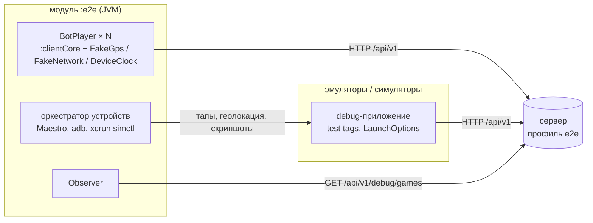

# End-to-end тесты

Несколько клиентов играют одну партию против настоящего сервера, а тесты автоматически проверяют правила: зону, находку, коды, споры, раскрытия, фон, обрывы сети. Слоя два.

| Слой | Кто играет | Где запускается | Команда |
|---|---|---|---|
| Быстрый | headless-боты на клиентском коде приложения | локально перед PR и nightly (`nightly.yml`, job `E2E bots`) | `./gradlew :e2e:test` |
| Медленный | приложение на Android-эмуляторах и iOS-симуляторах + боты | локально (в том числе из Android Studio) и nightly (`nightly.yml`, job'ы `Android emulators`, `iOS simulator`) | `./gradlew :e2e:devices` (свои эмуляторы) или `e2e/run-devices.sh --android 2 --bots 3` |

Оба слоя на push не запускаются: `ci.yml` остаётся быстрым, а `./gradlew check` не зависит от `:e2e:test`. Поэтому:
- меняете правила, протокол или поведение клиент–сервер — перед PR сами запустите `./gradlew :e2e:test` (~3 мин, работает и в облачном контейнере без KVM);
- меняете UI или платформенный код — запустите сценарии на своих эмуляторах из Android Studio ([e2e-local.md](e2e-local.md)) или ночной workflow вручную на своей ветке (`suite=devices`, [ниже](#ci)).

Подробности и таблица «что запускать» — [ci-cd.md](ci-cd.md#что-запускать-перед-pr). Как запустить оба слоя у себя, пошагово и с разбором частых проблем, — [e2e-local.md](e2e-local.md).


```mermaid
flowchart LR
    subgraph e2e["модуль :e2e (JVM)"]
        bots["BotPlayer × N<br/>:clientCore + FakeGps / FakeNetwork / DeviceClock"]
        orch["оркестратор устройств<br/>Maestro, adb, xcrun simctl"]
        obs["Observer"]
    end
    subgraph devices["эмуляторы / симуляторы"]
        app["debug-приложение<br/>test tags, LaunchOptions"]
    end
    bots -->|"HTTP /api/v1"| server[("сервер<br/>профиль e2e")]
    orch -->|"тапы, геолокация, скриншоты"| app
    app -->|"HTTP /api/v1"| server
    obs -->|"GET /api/v1/debug/games"| server
```

## Быстрый слой: боты

### Запуск

```bash
./gradlew :e2e:test                               # все сценарии, ~3 мин
./gradlew :e2e:test --tests '*ZoneTest*'          # один класс
./gradlew :e2e:test --tests '*NetworkTest.networkOutageOf30Seconds'
```

`:e2e:test` не входит в `check`, его запускают только явно. В `check` идёт `:e2e:unitTest` — юнит-тесты самих инструментов (маршруты, шум GPS, разбор дерева UI, аудит снапшотов, уникальные аккаунты) без партий.

Тесты сами поднимают настоящий Spring Boot сервер в том же процессе на случайном порту с профилем `e2e` и на свежей базе PostgreSQL: `TestPostgres` из test fixtures сервера создаёт базу `hovanki_test_<random>` на сервере из `HOVANKI_TEST_DATABASE_URL` (например, `jdbc:postgresql://localhost:5432/hovanki?user=hovanki&password=hovanki`, пользователю нужен CREATEDB) или, без переменной, поднимает встроенный PostgreSQL; в конце прогона база удаляется. Сценарии идут в реальном времени и в основном ждут игровые таймеры, поэтому JUnit гоняет их параллельно (`e2e/src/test/resources/junit-platform.properties`). Нагрузочный тест помечен `@Isolated` и идёт один.

Те же сценарии против внешнего сервера — например, чтобы смотреть его логи или профилировать:

```bash
SPRING_PROFILES_ACTIVE=e2e ./gradlew :server:bootRun
HOVANKI_E2E_SERVER_URL=http://localhost:8080 ./gradlew :e2e:test
```

Сервер обязательно с профилем `e2e`, иначе наблюдателю не к чему обращаться, и сценарии падают с понятной ошибкой. Ему нужна своя база PostgreSQL (`deploy/compose.dev.yaml`, см. README); аккаунты прошлых прогонов в ней остаются, поэтому ники и email у ботов каждый раз новые (`BotAccount.unique`).

### Как устроен бот

`BotPlayer` — это не копия клиента, а настоящий клиентский код из `:clientCore` на имитированном телефоне:

| Часть приложения | В боте |
|---|---|
| `GameSessionManager`, `AccountManager`, `SocialManager`, `HttpGameApi` / `HttpAccountApi` / `HttpSocialApi` (Ktor), `PollingGameConnection`, `LocationOutbox`, `ServerClock`, `catchCodeToShow`, `chatLines` | те же классы из `:clientCore`, связанные как в приложении: один `ClientStorage` и `ServerUrl`, аккаунт передаётся в `GameSessionManager` |
| Движок Ktor | OkHttp — тот же, что на Android |
| `LocationProvider` (Fused / CLLocationManager) | `FakeGps`: позиция на маршруте `Route` плюс шум `GpsNoise`, метки времени — по часам устройства |
| Часы телефона | `DeviceClock` со сдвигом (`clockSkew`) |
| Сеть | `FakeNetwork` — OkHttp-интерцептор: «роняет» сеть (`IOException`, как в тоннеле) и видит каждый ответ |
| `BackgroundTracker` | `FakeBackgroundTracker` — только запоминает, просило ли приложение фоновый режим |
| `SecureStore` (Keystore / Keychain) | `PhoneStorage` — в памяти «телефона» (сессия игры и аккаунт), переживает `killApp()` |
| Процесс приложения | `killApp()` / `launchApp()`: процесс с outbox и соединением пропадает; GPS, сеть, часы и хранилище остаются. Новый процесс, как приложение на телефоне, восстанавливает аккаунт (`restore`) и возвращается в сохранённую игру (`resumeSavedGame`) |
| Человек с телефоном | Ник, email и пароль (`BotAccount`) знает сценарий, а не телефон: `newPhone()` — тот же человек с новым телефоном, где ничего не сохранено |

Что бот делает сам, как человек с телефоном, задаёт `BotBehavior`:
- `onClaim` — реакция прячущегося на заявку: показать код (`ShowCode`), оспорить (`Dispute`) или молчать (`Ignore`);
- `onDispute` — как голосовать в чужом споре.

Остальное делает сценарий: ходит, жмёт «нашёл», вводит код, выключает GPS или сеть, убивает приложение.

**Шум GPS** (`GpsNoise`, с seed, поэтому каждый прогон видит те же точки):
- гауссова ошибка в пределах accuracy (σ = accuracy / 2, обрезка по радиусу);
- `spikeProbability` — редкие точки «у домов» с accuracy 30–40 м: правила должны их игнорировать;
- `jumpProbability` — редкие прыжки на 20–35 м при нормальной accuracy: опасный случай, ради которого правила никогда не решают по одной точке;
- флаг `isMock`.

Пресеты: `GpsNoise.NONE` (точные позиции, accuracy 5 м), `openSky(seed)`, `city(seed)`. Для геометрии, которая должна сходиться до метра, есть `GpsNoise(..., exact = true)`.

**Приватность проверяется всегда.** Каждый ответ, который получил любой бот в любом сценарии, проходит `SnapshotAudit`:
- прячущийся не получает ни одной позиции (в JSON ответа нет ключа `location`; ищутся именно ключи, так что текст чата или имя «location» не мешают);
- ищущий видит ищущих только как `TEAMMATE`, а прячущихся — только с причиной раскрытия и только в SEEKING;
- в LOBBY и FINISHED позиций нет;
- секрет кода получает только прячущийся;
- в `VisibleLocation.reason` приходят только причины первой версии протокола; новые, как `INSIDE_BUILDING`, — только в `cause`;
- каждое сообщение чата — из канала, который зритель может видеть с его ролью в этом снапшоте (`ChatRules.canSee`); в LOBBY — только `ALL`.

Нарушение валит сценарий.

### Наблюдатель

Проверки идут по правде сервера, а не по тому, что видят боты. Debug-эндпоинт `GET /api/v1/debug/games` и `/api/v1/debug/games/{gameId}` (`DebugController`, DTO — `app.hovanki.shared.debug`) отдаёт полное состояние:
- фаза и зона;
- все позиции, последняя пригодная точка, когда пришла последняя точка;
- счётчики точек: принята, mock, не по порядку, невозможный скачок;
- предупреждение о зоне, время входа в здание и причина раскрытия для ищущих;
- когда приложение игрока загрузило здания для карты;
- статус зданий игры (`LOADING` / `READY` / `UNAVAILABLE`);
- заявки с голосами и оценкой расстояния.

Ещё два debug-маршрута:
- `GET /api/v1/debug/emails/{email}` — письма, которые сервер отправил на адрес (`hovanki.mail.sender: recording` в профиле `e2e`). Отсюда боты читают коды, как человек в своей почте: `observer.awaitEmail(email, purpose, known)` ждёт новое письмо — сервер отправляет асинхронно, после коммита транзакции;
- `GET /api/v1/debug/reports` — жалобы на сообщения чата (`observer.reports()`).

**Здания в профиле `e2e` — тестовый квартал.** Вместо Overpass сервер берёт `FakeBuildingSource`: один квартал `DebugBuildings` с аркой, в ~150 м к северо-западу от центра зоны. Координаты квартала знают и сервер, и сценарии, внешний сервис не нужен. Для зон около Null Island (`DebugBuildings.NO_DATA_AT`, 0°, 0°) данных нет — так сценарий проверяет игру с выключенным правилом. Слой устройств по умолчанию берёт настоящие здания (см. [«Где идёт игра»](#где-идёт-игра-и-какие-здания)).

**Эндпоинт существует только в Spring-профиле `e2e`.** В обычном профиле бина нет и маршруты отвечают 404 — это закреплено тестом `DebugEndpointAbsentTest`. При старте с профилем `e2e` сервер пишет WARN. В проде профиль не включать.

### Сценарии

Все пороги берутся из `GameRules`, но с короткими таймерами (`GameSetups.FAST_RULES`): прятки 10 с, код 10 с, голосование 8 с, раскрытие при молчании 15 с, окно решений 10 с, sync раз в 1 с.

| Класс | Сценарий | Что проверяет |
|---|---|---|
| `FullRoundTest` | Full round | Лобби по коду, старт с одним ищущим, прячущиеся расходятся (один с «городским» шумом), зона сужается, три находки по коду, игра заканчивается, когда пойманы все; фоновый трекинг включается и выключается. Итоги остаются на экране и продолжают обновляться (ради чата), пока игрок их не закроет (`leave`); сохранённой сессии уже нет |
| `AccountTest` | Sign up with an emailed code | Регистрация: вход сразу, email не подтверждён; письмо на языке приложения; ник и email заняты без учёта регистра; неверный код → `INVALID_CODE` без `reason`; повторная отправка — новый код заменяет старый; подтверждение |
| | Log in by nickname and by email | Новые телефоны: неверный пароль и неизвестный ник — одинаковый `WRONG_CREDENTIALS`; вход по нику и по email без учёта регистра; перезапущенное приложение снова в аккаунте; выход на одном телефоне не трогает другие |
| | Password reset | Код сброса на email (на адрес без аккаунта — тот же ответ и ни одного письма), неверный код, новый пароль: старый не работает, старые телефоны разлогинены при следующем запросе (`SESSION_EXPIRED`) или запуске |
| | Delete the account | Неверный пароль — ничего не удалено; удаление: выход, другой телефон разлогинен, входа нет ни по нику, ни по email, ник и email снова свободны |
| | A logged-in player and a guest in one game | Вошедший создаёт игру и играет под ником (`PlayerView.userId`) вплоть до итогов, гость — с `userId = null` |
| `AccountRejoinTest` | A new phone in the middle of a round | Вошедший в SEEKING берёт новый телефон, входит в аккаунт и в игру по коду: тот же игрок и роль, секрет кода, чат с начала игры, фоновый трекинг; старый телефон при следующем опросе получает `SessionLost`, забывает игру, но остаётся в аккаунте; точки идут с нового телефона, находка — по коду с его экрана |
| | A guest can't take over a player | Гость с другого телефона в идущую игру не входит (`WRONG_STATE`), его старый телефон играет дальше |
| `ChatTest` | Chat through a game | Лобби: только `ALL`, даже если выбрана «команда»; гость и вошедший в строках чата; счётчик непрочитанных. SEEKING: сообщения команды видят только ищущие (`SEEKERS`) или только прячущиеся (`HIDERS`), никто не получает чужих. После конца игры чат на экране итогов работает, пока игрок его не закроет (`leave`) |
| | Chat limit and reports | 6-е сообщение за 10 с → `TOO_MANY_REQUESTS`, лимит у каждого свой и через 10 с проходит. Жалоба попадает к модераторам (`observer.reports()`) с текстом, автором и жалобщиком; повторная жалоба — та же запись, жалоба гостя — своя; на своё сообщение — `FORBIDDEN`, на несуществующее — `NOT_FOUND` |
| | Blocked player's messages | Заблокировавший сразу не видит ни старых, ни новых сообщений заблокированного (и они не считаются непрочитанными), остальные видят; после разблокировки они снова на месте |
| `SocialTest` | Friends by nickname | Заявка по нику в любом регистре → входящие у второго (и в inbox) → принять → друзья у обоих; неизвестный и неподтверждённый ник — `USER_NOT_FOUND`, себе — `BAD_REQUEST`; повторная заявка другу ничего не меняет; удаление из друзей |
| | Friends from a game | «+ в друзья» из лобби по `userId` из снапшота, у гостя `userId` нет и заявок он слать не может (`ACCOUNT_REQUIRED`); встречные заявки — сразу друзья; отклонить и отозвать заявку |
| | Blocks | Блокировка убирает дружбу и из групп заблокировавшего; заблокированный об этом не узнаёт, его новая заявка для него «отправлена», но заблокировавшему не видна; ответная заявка — `BLOCKED_BY_YOU`; разблокировка удаляет заявки, отправленные во время блокировки |
| | Groups: create, leave, hand over | Группа только из друзей (`NOT_FRIENDS`), переименовать может только владелец (`NOT_GROUP_OWNER`); владелец выходит — группа переходит к самому давнему участнику; вышел последний — группы нет |
| | Account deletion hands the group over | Удалённый аккаунт передаёт свою группу следующему участнику и пропадает из друзей |
| | Invites into the lobby | Приглашение друга: во входящих — от кого, код и срок 30 мин; вход по коду с аккаунтом отвечает на приглашение; отклонить; старт игры убирает приглашения. Не друг — `NOT_FRIENDS`, гость — `ACCOUNT_REQUIRED`, после старта — `WRONG_STATE` |
| | Group invites | Любой участник группы (не только владелец) зовёт всю группу: приглашение с названием группы получают все, кроме уже играющих, самого приглашающего и тех, с кем у него блокировка в любую сторону |
| `CatchTest` | Hider stays silent | Нет реакции → `CONFIRMED` ровно по таймауту кода, конец игры — в тот же момент |
| | Dispute rejected by votes | Спор, оба голоса против → `REJECTED` сразу, не дожидаясь дедлайна |
| | Dispute without votes, far apart | 65 м при accuracy 16 м: заявку принять можно, но наиболее вероятное расстояние > 40 м → `REJECTED` по дедлайну |
| | Dispute without votes, close | Рядом, голосов нет → `CONFIRMED` |
| | Claim from far away | 150 м → `TOO_FAR`, заявка не создаётся |
| | Claim without seeker location | GPS ищущего выключен с начала → `NO_LOCATION` |
| `ZoneTest` | Out of the zone and back | Предупреждение, раскрытие `OUT_OF_ZONE`, возврат снимает предупреждение, после старого дедлайна игрок в игре |
| | Out of the zone for good | `ELIMINATED` только после grace-периода |
| | One bad fix outside the border | Одна принятая точка за границей (прыжок) — ни предупреждения, ни раскрытия |
| | One bad fix inside the border | Одна точка «внутри» не снимает предупреждение и не сбрасывает таймер |
| `FairPlayTest` | GPS off, app keeps syncing | Молчание GPS при живом sync → `STALE_SIGNAL` через `staleLocationRevealSeconds`, в последней известной точке |
| | Mock location | Мок-точки → `MOCK_LOCATION`; в трек не попадают, ищущий видит последнюю честную точку |
| | Teleport | Скачок на ~1 км → точки отброшены как невозможные, зона не решает, затем `STALE_SIGNAL` в настоящей точке |
| `NetworkTest` | Network outage for 30 s | Во время обрыва — `STALE_SIGNAL`; после — `LocationOutbox` отдаёт всё накопленное без потерь и отбраковки, состояние сходится |
| | Device clocks off by ±2 min | Точки в порядке и во времени сервера, обратный отсчёт верный, код по `ServerClock` принимается, код по часам телефона — нет |
| `BuildingsTest` | Hiding in a building | Приложение хоста загрузило здания, которые рисует карта (`GET /buildings`). Прячущийся заходит в квартал: предупреждение с временем раскрытия, ищущий его пока не видит; через `insideBuildingRevealSeconds` — раскрытие с `cause = INSIDE_BUILDING` и `reason = OUT_OF_ZONE` для старых клиентов, игрок не выбывает; вышел — раскрытие и предупреждение сняты |
| | One GPS jump into a building | Одна принятая точка на 18 м внутрь квартала — ни предупреждения, ни раскрытия |
| | Out of a building before the reveal | Вышел до раскрытия — предупреждение снято, ищущий его так и не увидел |
| | Standing in an arch | Прячущийся стоит в арке сквозь квартал (4 м, по 20 м здания с боков) дольше времени раскрытия — ни предупреждения, ни раскрытия |
| | No building data | Источник не дал зданий: снапшот у всех `UNAVAILABLE`, приложения ничего не грузят, прячущегося «в квартале» не предупреждают и не раскрывают |
| | Caught inside a building | Раскрытого в здании ищущий догоняет внутри и ловит по коду, как обычно; пойманного больше не предупреждают и не показывают, игра идёт дальше |
| `PrivacyTest` | Privacy through a whole game | Партия со всеми раскрытиями: ищущие видели ровно `TEAMMATE`, `MOCK_LOCATION`, `STALE_SIGNAL`, `OUT_OF_ZONE` нужных игроков, прячущиеся — никого |
| `RestartTest` | App killed and relaunched mid-round | Пока приложение мертво, сервер держит игрока и раскрывает его как `STALE_SIGNAL`. Перезапущенное приложение возвращается в игру по сохранённой сессии: тот же игрок, снова есть секрет кода и фоновый трекинг, свежие точки снимают `STALE_SIGNAL`. Заявка подтверждается кодом с экрана, до таймаута |
| | App relaunched after the game ended | Приложение убито, игра тем временем закончилась. Перезапущенное находит сохранённую сессию, узнаёт у сервера `FINISHED`, стирает её и показывает главный экран с `SavedGameFinished` |
| `LoadTest` | Load: 3 games x 30 bots | 3 параллельные игры по `Game.MAX_PLAYERS`, sync раз в 3 с, 40 с игры: ноль ошибок, все точки доходят, p95 `/sync` < 500 мс |

### Как написать новый сценарий

```kotlin
class MyTest {
    @Test
    fun hiderHidesBehindTheSeeker() = scenario("Hider hides behind the seeker") {
        val sam = player("Sam", at = PARK)                                  // телефон с приложением
        val anna = player("Anna", at = PARK, behavior = BotBehavior(onClaim = ClaimReaction.Ignore))

        sam.createsGame(GameSetups.fast())                                  // короткие таймеры
        join(anna)
        sam.startsGame(seekers = listOf(sam))
        anna.walksTo(PARK.offset(eastMeters = 30.0))                        // маршрут, 1.5 м/с
        awaitPhase(GamePhase.SEEKING, within = 20.seconds)

        sam.catchesUpWith(anna)                                             // догнать и дать точкам дойти
        sam.claimsCatch(anna)
        awaitCatch(anna, CatchStatus.CONFIRMED, within = 15.seconds)        // правда сервера (наблюдатель)
        check(anna.snapshot?.me?.status == PlayerStatus.CAUGHT, "Anna's phone knows")
    }
}
```

- `scenario(name) { ... }` (в `e2e/src/test`) запускает партию против `E2eServer`, пишет отчёт и проверяет приватность.
- Игроки: `player(name, at, noise, behavior, clockSkew)`.
- Действия бота: `walksTo`, `arrives`, `follows(route)`, `teleportsTo`, `turnsGpsOff/On`, `startsMockingLocation`, `losesNetwork/regainsNetwork`, `claimsCatch`, `entersCodeShownBy`, `catches`, `killApp/launchApp`, `vote`, `dispute`, `leave`.
- Аккаунты: `newAccount(name)` — уникальные ник и email (сценарии идут параллельно на одном сервере), `bot.signsUp()` — регистрация и код из письма, `bot.logsIn(account, login)`, `bot.resetsPassword(account, newPassword)`, `bot.newPhone()`, `emailedCode(email, purpose, known)`. Кнопки по отдельности — у `BotPlayer`: `register`, `verifyEmail`, `resendCode`, `logIn`, `logOut`, `requestPasswordReset`, `resetPassword`, `changePassword`, `deleteAccount`, `refreshAccount`; состояние — `accountState`, `userId`.
- Друзья, группы, приглашения и чат (`BotPlayer`, через `SocialManager` и `GameSessionManager`): `sendFriendRequest(nickname | userId)`, `acceptFriendRequest`, `block`, `createGroup`, `addGroupMembers`, `refreshInbox` / `inbox`, `invite(userIds, groupId)`, `sendChat(text, team)`, `reportChat(seq)`, `chat` (строки, как в панели чата). В сценарии: `bot.befriends(other)` — заявка по нику и принятие, `bot.createsGroup(name, members)`.
- Правда сервера: `state()`, `bot.onServer()`, `lastClaimOn(hider)`.
- Ожидания: `awaitPhase`, `awaitCatch`, `awaitStatus`, `awaitReveal(hider, reason, to = seeker)`, общее `eventually { ... }` / `awaitThat { ... }`, `holdsFor(period) { ... }` — «всё это время».
- Проверки: `check(condition, what)`, `requireOk(result, what)`, `expectRejected(result, ErrorCode.X, what)` или `expectRejected(result, ErrorReason.X, what)`. Каждая успешная проверка попадает в таймлайн с «✓».

Советы:
- Геометрия, которая должна сходиться до метра (порог 40 м, граница зоны), — через `GpsNoise(..., exact = true)`: иначе шум иногда будет «прав».
- Решения сервера смотрят на окно `decisionWindowSeconds`. После того как бот пришёл на место, подождите окно целиком (`delay((rules.decisionWindowSeconds + 2).seconds)`), иначе в окне останутся точки с дороги.
- Не делайте жёстких `delay` на таймеры сервера: ждите состояние через `eventually` с запасом.
- Нашли баг в игре — не обходите его в сценарии: чините отдельным коммитом с тестом (`GameTest` / `commonTest`) и оставляйте сценарий, который его ловит.

### Как читать отчёт

Каждый сценарий пишет `e2e/build/reports/e2e/<scenario>.md`. В CI это артефакт `e2e-reports` запуска `nightly.yml` (job `E2E bots`). В отчёте:
- **Result** — passed или причина падения;
- **Final state (observer)** — игроки с ролями и статусами, счётчики точек (accepted / mock / out of order / implausible), текущая причина раскрытия, заявки с голосами и оценкой расстояния;
- **Sync** — число запросов, p50/p95/p99/max `/sync`, неудачные запросы (ожидаемые 4xx вроде `TOO_FAR` тоже считаются);
- **Timeline** — по секундам от старта: действия ботов, что каждый увидел (смена фазы, заявки, кого видит и почему, предупреждения, связь), проверки с «✓».

При падении тот же таймлайн приходит в сообщении ошибки теста, поэтому в логе CI сразу видно, на каком шаге и после чего сломалось.

## Медленный слой: приложение на эмуляторах и симуляторах

### Что нужно

- JDK 21.
- Maestro 2.10+: `curl -fsSL https://get.maestro.mobile.dev | bash` (бинарник в `~/.maestro/bin`). В CI закреплена версия 2.10.0 (`MAESTRO_VERSION`).
- Android:
  - Android SDK с пакетом Android SDK Command-line Tools: Android Studio по умолчанию его не ставит (Settings → Languages & Frameworks → Android SDK → SDK Tools). SDK скрипт ищет, как AGP: `sdk.dir` в `local.properties`, затем `ANDROID_HOME`, затем место установки Android Studio по умолчанию (`~/Library/Android/sdk`, `~/Android/Sdk`);
  - аппаратное ускорение: KVM на Linux, Hypervisor.framework на Mac.
  - Системный образ `system-images;android-33;google_atd;<x86_64|arm64-v8a>` и эмулятор скрипт поставит сам через `sdkmanager`.
    - ATD (Automated Test Device) — образ Google для автотестов: без SystemUI, Settings и встроенных приложений, с меньшей нагрузкой на CPU и память. В CI два эмулятора работают на раннере с 2 ядрами и 7 ГБ.
    - Вариант `google_atd` нужен ради Google Play services для FusedLocationProvider. ATD есть для API 30–33.
    - Другой образ: `HOVANKI_E2E_API_LEVEL=34 HOVANKI_E2E_IMAGE_TAG=google_apis`, память эмулятора — `HOVANKI_E2E_EMULATOR_MEMORY` (по умолчанию 2048 МБ).
- iOS: Mac на Apple Silicon с Xcode 26.4+.

### Из Android Studio на своих эмуляторах

Пошагово, с подготовкой, параметрами и частыми проблемами, — [e2e-local.md](e2e-local.md). Коротко:

1. Поставьте Maestro и запустите один или два эмулятора в Device Manager (Google APIs / Google Play).
2. Конфигурация из папки **E2E** (`.run/`): `E2E emulators: full-round`, `restart` или `all scenarios` → Run. Из терминала — `./gradlew :e2e:devices -Pe2e.scenario=all`.
3. Задача соберёт jar сервера и debug APK, поставит приложение на все запущенные эмуляторы, поднимет сервер с профилем `e2e` на `:8080` рядом со встроенным PostgreSQL, прогонит сценарии и вернёт настройки эмуляторов. Отчёт — [как у скрипта](#отчёт).

Скрипт и bash не нужны: работает на macOS, Linux и Windows. iOS-симуляторы — только скриптом.

### Запуск скриптом

```bash
e2e/run-devices.sh --android 2 --bots 3 --scenario full-round         # 2 эмулятора + 3 бота
e2e/run-devices.sh --ios 1 --bots 3 --scenario all                     # симулятор, оба сценария (Mac)
e2e/run-devices.sh --android 1 --ios 1 --bots 2                        # смешанная партия (Mac)
e2e/run-devices.sh --android-serials emulator-5554 --skip-build --keep # свой уже запущенный эмулятор
e2e/run-devices.sh --ios 1 --fail-fast                                  # после первого упавшего сценария — стоп
```

Что делает скрипт:
1. Собирает jar сервера, debug APK, приложение для симулятора (`xcodebuild`) и CLI `:e2e` (`installDist`).
2. Создаёт AVD `hovanki-e2e-N` через `avdmanager`, если их нет, и запускает эмуляторы без окна на портах 5554, 5556…
   - Экран Pixel 6 в 720×1600, чтобы программный GPU меньше грузил CPU. Анимации выключены, геолокация включена, 2 ГБ памяти.
   - Сворачивание (`KEYCODE_HOME`) проверяется: если приложение осталось на экране (образ без лаунчера), сценарий падает с понятной ошибкой, а не проверяет «фон» на открытом приложении.
   - Приложение ставится с `adb install -g`: разрешения на геолокацию и уведомления выданы заранее.
3. Создаёт симуляторы `hovanki-e2e-N` на свежем iOS runtime и грузит их по одному, ставит приложение и один раз запускает его вхолостую.
   - Разрешение на геолокацию заранее не выдаётся: флоу отвечают на системный запрос, как игрок (`allow-location.yaml`).
4. Запускает `e2e devices` с `--server-jar`. Он поднимает сервер на `:8080` (`--port`) с профилем `e2e`, access log и свежей базой PostgreSQL (`LocalServer`, `LocalPostgres`):
   - база — встроенный PostgreSQL (zonky, без Docker) на свободном порту; с `HOVANKI_TEST_DATABASE_URL` — новая база `hovanki_e2e_<random>` на том сервере. В конце прогона база удаляется;
   - серверу она передаётся через `SPRING_DATASOURCE_*` в окружении процесса, пароль не виден в списке процессов;
   - логи — в `e2e/build/reports/devices/logs/`: `server.log`, `access*.log`. В access log пишутся строка запроса, статус и время; заголовков там нет, так что нет и токенов.

   Потом прогревает сервер игрой ботов, дальше идут сценарии, скриншоты, логи и отчёт. В конце гасит сервер и базу.
5. Гасит эмуляторы и симуляторы (`--keep` оставляет устройства).

В CI (переменная `CI`) скрипт останавливает Gradle- и Kotlin-демоны после сборки и ограничивает heap сервера, CLI и Maestro: память нужна устройствам.

Роли:
- Первое устройство — хост. Создавать игры в приложении может только вошедший, поэтому хост играет с аккаунтом:
  - оркестратор сам регистрирует его через API и подтверждает email кодом из письма (debug-маршрут `emails`, `DeviceAccounts`) — формы регистрации сценарий не проходит;
  - ник и email уникальны для каждого сценария (`Android1_<случайное>` / `android1_…@hovanki.test`);
  - приложение входит в аккаунт само, при старте, по параметрам запуска `name` (ник) + `password`, и показывает вкладку «Играть» (`home_screen`).
- Ищущий — второе устройство. Если устройство одно, ищущий — хост в `full-round` и бот в `restart`.
- Остальные устройства — гости: стартуют с `logOut` (аккаунт, оставшийся от прошлого сценария, стирается), на экране приветствия (`welcome_screen`) уже вписаны имя (`Android-2`, `iOS-1` и т.д.) и код игры, флоу `join-game` нажимает «Войти».
- Все боты — гости и прячутся, как и остальные устройства.
- После итогов «Назад» ведёт хоста снова на вкладку «Играть» (он остаётся в аккаунте), гостей — на экран приветствия.

### Сценарии на устройствах

| Сценарий | Что проверяет |
|---|---|
| `full-round` | Хост (в аккаунте, играет под ником) создаёт игру на телефоне там, где он есть (с настройками по умолчанию, кроме времени пряток), остальные телефоны входят по коду гостями, боты — через API, хост выбирает ищущего. На каждом устройстве экраны сменяются по фазам: лобби → прятки → поиск → результаты. Свёрнутое приложение продолжает слать точки (foreground service / фоновый режим location), сервер видит движение. Карта: приложение каждого телефона загрузило здания зоны (сервер это видит), экран прокручивается до строки атрибуции OpenStreetMap, скриншот `map` — на нём запретные здания красным. Здания: прячущийся-телефон идёт в настоящее здание рядом, достаточно глубокое для его точности GPS; сервер уверен, что он внутри, приложение предупреждает с обратным отсчётом (скриншот); игрок остаётся, пока ищущие его не увидят (`INSIDE_BUILDING`, не выбывает, баннер без отсчёта, скриншот карты у ищущего); выходит на открытое место — раскрытие и баннер сняты. Ищущий на телефоне ловит ботов, вводя 4 цифры вручную, и телефоны: код с экрана прячущегося сверяется с TOTP сервера и принимается. «Назад» на итогах: хост — на вкладке «Играть», гости — на экране приветствия. Скриншоты в каждой фазе |
| `restart` | Приложение хоста-прячущегося убито посреди раунда. Пока оно мертво, сервер держит игрока и раскрывает его ищущим как `STALE_SIGNAL`. Запущенное заново (без `forgetSavedGame`) приложение восстанавливает аккаунт хоста и возвращается на экран поиска по сохранённой сессии, свежие точки снимают раскрытие. Ищущий делает заявку, код читается с экрана вернувшегося приложения, вводится (ищущий-телефон через `enter-code`, ищущий-бот через API) и принимается до таймаута. Скриншоты: раскрытие у ищущего, экран после возврата, код |

С одним устройством (как iOS в CI) проверки «код с экрана прячущегося-телефона» и «прячущийся-телефон в здании» не выполняются: прячутся только боты. Их покрывает Android с двумя эмуляторами.

### Где идёт игра и какие здания

- **Место — где устройство-хост.** Хост создаёт игру по своей текущей геопозиции, как игрок: на эмуляторе это точка из Extended Controls → Location, на симуляторе — Features → Location. Сценарий берёт центр зоны у сервера и от него расставляет остальные телефоны, ботов и места пряток. До этого момента оркестратор геопозицию хоста не трогает.
- `run-devices.sh --device-location LAT,LON` ставит устройствам их «собственную» точку до прогона — как Extended Controls. В CI это центр Варшавы (Plac Defilad, рядом с Дворцом культуры; input `device_location` у Nightly): у свежего эмулятора в CI точка в сельской Калифорнии, где зданий нет, у свежего симулятора её нет вовсе.
- `--location LAT,LON` (`-Pe2e.location=…`) — играть в заданной точке: оркестратор сразу ставит её всем устройствам.
- Если у хоста нет геопозиции (свежий симулятор, как iOS в CI), приложение через 20 с говорит «не удалось определить местоположение». Флоу создания сразу падает, сценарий ставит запасную точку (парк в Киеве) и нажимает «Создать» ещё раз, с «⚠» в отчёте.
- Место игры в отчёте — с точностью до километра («around 37.42, -122.08»): видно, какой район на карте, но не точка, где стоит эмулятор.
- **Здания — настоящие**, из OpenStreetMap через Overpass (`--buildings overpass`, по умолчанию). Места пряток сценарий выбирает на открытом месте, не ближе 12 м к стенам (`BuildingSearch`, та же `BuildingMap`, по которой судит сервер). Для проверки правила он берёт ближайшую к прячущемуся точку внутри здания глубже `accuracy + 5 м`.
- `--buildings fake` — тестовый квартал вместо Overpass; `--buildings off` — без правила.
- Overpass не ответил — игра идёт без правила. Сценарий проверяет баннер «правило зданий выключено» в лобби на каждом телефоне, а проверку правила пропускает с «⚠». Нет здания нужной глубины рядом — тоже «⚠» и пропуск.

### Как это устроено

- **UI** — Maestro-флоу в `e2e/maestro/`: `create-game`, `create-game-again`, `join-game`, `allow-location`, `start-game`, `claim-catch`, `enter-code`, `close-results`, `await-visible`, `await-gone`, `scroll-edge-down`, `scroll-edge-up`.
  - Элементы ищутся по test tags из `TestTags` (`:clientCore`, `app.hovanki.client.automation`). На Android это resource-id в debug-сборке, на iOS — `accessibilityIdentifier`.
  - Переменные передаются через env, `APP_ID` оркестратор ставит сам.
- **Как вызывается Maestro** (`--maestro-mode`, по умолчанию `auto`):
  - `maestro test` на каждый шаг — эмуляторы и несколько симуляторов. Каждый вызов заново запускает драйвер: на эмуляторе это ~10 с.
  - Один долгоживущий `maestro mcp` — единственный iOS-симулятор. MCP-сервер держит сессию драйвера на устройство. Иначе каждый шаг на симуляторе в CI стоил бы больше минуты, дольше игровых фаз.
  - Несколько симуляторов MCP-сервер ведёт через один порт XCTest ([maestro#3611](https://github.com/mobile-dev-inc/maestro/issues/3611)), поэтому для них остаётся CLI.
  - `mcp` / `cli` включают нужный режим принудительно.
- **Параметры запуска** вместо ввода руками (только debug, см. [architecture.md](architecture.md#автоматизация-ui-только-debug); собирает их `appLaunchOptions`). Приложение применяет их при старте процесса по порядку: сервер → `forgetSavedGame` / `logOut` → восстановление аккаунта → вход по `name` + `password` → возврат в сохранённую игру.
  - Первый запуск в сценарии передаёт `forgetSavedGame`: игра, оставшаяся от прошлого сценария на том же устройстве, стирается, и приложение начинает с главного экрана. Перезапуск в `restart` его не передаёт — приложение восстанавливает аккаунт и возвращается в игру.
  - Хост: `name` = ник и `password`. Сохранённый аккаунт с тем же ником остаётся, другой заменяется входом.
  - Гость: `logOut`, `name` (имя гостя) и `joinCode`.
  - Android: `adb shell am start … --es hovanki.server http://10.0.2.2:8080 --es hovanki.name Android1_k3x9a1 --es hovanki.password …` или deep link `hovanki://join?server=…&name=…&joinCode=…`;
  - iOS: `xcrun simctl launch <udid> app.hovanki.ios -hovanki.server http://localhost:8080 -hovanki.name iOS-1 -hovanki.logOut true -hovanki.joinCode ABC234`.
  - Пароль в `commands.log` заменяется на `***`.
- **Геолокация** — тот же `Route`, что у ботов. Раз в секунду:
  - Android: `adb -s emulator-5554 emu geo fix <lon> <lat>`;
  - iOS: `xcrun simctl location <udid> set <lat>,<lon>`.

  Отдельно маршрут можно напечатать или «проиграть» в устройство:

  ```bash
  ./gradlew :e2e:route --args="--to 50.4481,30.5402 --speed 1.5 --format geo-fix"   # печать
  ./gradlew :e2e:route --args="--to 50.4481,30.5402 --adb emulator-5554"            # в эмулятор
  ./gradlew :e2e:route --args="--to 50.4481,30.5402 --simctl <udid> --noise city"   # в симулятор, с шумом
  ```

- **Сервер** — тот же jar, что в проде, с профилем `e2e` (письма с кодами остаются в памяти для debug-маршрута `emails`) и своей базой PostgreSQL на прогон (`LocalPostgres`, см. [запуск скриптом](#запуск-скриптом)). Устройства ходят на `http://10.0.2.2:<port>` (эмулятор) и `http://localhost:<port>` (симулятор), боты и наблюдатель — на `http://localhost:<port>`.
- **Повторы** — только там, где на CI-машинах наблюдались сбои окружения. Каждый повтор пишется в таймлайн со знаком «⚠», второй сбой валит сценарий:
  - «Create» ещё раз, если приложение показало «Cannot reach the server». На macOS-раннере сервер однажды ответил на создание игры через 15.9 с при таймауте приложения 15 с, а тот же запрос следом — за 0.3 с.
  - Тап ещё раз, если после него на экране ничего не изменилось. На iOS-симуляторе тап по кнопке Compose иногда не становится кликом: UIKit касание доставил, `onClick` не вызвался.

### Отчёт

`e2e/build/reports/devices/`:
- `index.md` — список сценариев со статусом;
- `<scenario>/index.html` — скриншоты по моментам (лобби, прятки, поиск, фон, код на экране, результаты, падение), таймлайн с проверками «✓» и предупреждениями «⚠»;
- `<scenario>/report.md` — то же в markdown;
- `<scenario>/logs/<устройство>.log` — logcat или лог процесса приложения на симуляторе вместе с его stdout/stderr;
- `<scenario>/final-state.json` — полное состояние игры от наблюдателя;
- `logs/server.log`, `logs/access*.log`, `logs/emulator-N.log`, `logs/xcodebuild.log`, `logs/maestro-mcp.log`;
- `commands.log` — каждая команда adb / xcrun / maestro (и вызов MCP) с кодом выхода.

Если флоу упал, в сообщение попадает:
- вывод Maestro;
- дамп экрана: `id: текст [границы]`, отметки `(disabled)` / `(focused)`;
- скриншот `failed-<flow>`.

В логе CI при падении есть ещё:
- кто слушает порт сервера;
- память и swap;
- запросы из access log;
- выжимка логов устройств.

### CI

`.github/workflows/nightly.yml` — nightly в 02:17 UTC и вручную на любой ветке: Actions → Nightly → Run workflow, `suite=devices` (или `all` вместе с ботами), сценарий и число ботов. Из командной строки: `gh workflow run nightly.yml --ref <ветка> -f suite=devices -f scenario=restart`. Если ночной прогон упал, открывается issue с меткой `nightly-failure` ([ci-cd.md](ci-cd.md#если-ночной-прогон-упал)).
- **`Android emulators`** (`ubuntu-latest`, ~15 мин):
  - KVM включается udev-правилом;
  - два эмулятора поднимает `e2e/run-devices.sh` (`reactivecircus/android-emulator-runner` рассчитан на один);
  - системный образ кэшируется.
- **`iOS simulator`** (`macos-26`, ~20 мин): один симулятор. На раннере 3 ядра и 7 ГБ; второй симулятор грузился ~17 мин и тормозил все шаги.

Артефакты: `e2e-devices-android`, `e2e-devices-ios` — весь каталог отчёта.

## Известные ограничения

- **iOS — только на Mac** с Xcode. На Linux работают боты и Android.
- **Эмуляторам нужно аппаратное ускорение** (KVM / Hypervisor.framework). В облачных контейнерах без KVM работает только быстрый слой (`:e2e:test`), слой устройств — локально (`./gradlew :e2e:devices`) или через ночной workflow, запущенный вручную на своей ветке.
- **Мок-геолокация — не настоящий GPS.**
  - `geo fix` и `simctl location` дают точку с постоянной accuracy, без шума, прыжков и потери сигнала. Реалистичный шум есть только у ботов.
  - Фоновые ограничения реальных телефонов они тоже не эмулируют. iOS может приостановить приложение, «энергосбережение» Android-производителей — остановить foreground service.
  - Проверка фона на эмуляторе и симуляторе необходима, но недостаточна: на реальных телефонах фон проверяется руками.
- **Точки симулятора iOS помечены как подменённые** (`isSimulatedBySoftware`). Для игроков на симуляторе оркестратор передаёт debug-параметр `allowSimulatedLocation`, поэтому анти-спуфинг на iOS-симуляторе в e2e выключен. Проверку `MOCK_LOCATION` покрывают боты.
- **Потерянные тапы на iOS-симуляторе.** Тап Maestro по кнопке Compose иногда не вызывает `onClick`: касание UIKit доставил, следующий тап срабатывает. Флоу повторяют такой тап один раз с «⚠» в отчёте. Бывает ли это у живых пользователей на iPhone, из CI не видно — стоит проверить на устройстве.
- **Один iOS-симулятор в CI.** Код с экрана прячущегося-телефона проверяется только на Android. Два и больше симуляторов — локально на Mac, через CLI Maestro, это медленнее.
- **Карта перехватывает свайпы.** Свайп, начатый на карте, двигает карту, а не экран. `scrollUntilVisible` в Maestro свайпает из центра экрана, поэтому до элементов под картой флоу `scroll-edge-down` / `scroll-edge-up` прокручивают свайпом по левому краю, по полю отступа экрана. Координаты свайпа в флоу — константы: Maestro проверяет их при разборе файла, до подстановки переменных.
- **Реальное время.**
  - Сценарии не ускоряют часы сервера.
  - Таймеры укорочены: через `GameRules` у ботов и через время пряток на устройствах. Остальные пороги игры, созданной с телефона, — по умолчанию: раскрытие при молчании 45 с, таймаут кода 60 с. Поэтому `restart` идёт несколько минут.
- **Боты ходят через OkHttp** — движок Android. Движок Darwin (iOS) проверяется только на симуляторах.
- **Нагрузочный тест** меряет сервер в том же процессе и на той же машине, что и 90 ботов. Это проверка на регрессии и ошибки под нагрузкой, а не бенчмарк продакшн-сервера.
